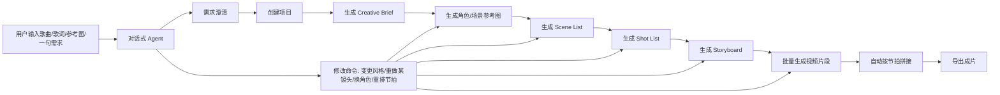
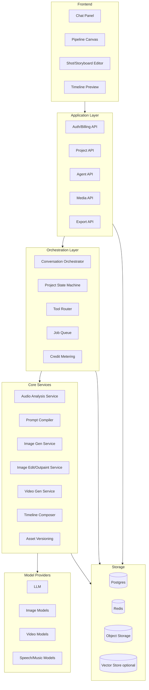

# VidMuse.ai 逆向拆解与单人复刻方案

> 写作目的：基于公开教程与产品表现，逆向推测 `vidmuse.ai` 这类“AI 音乐视频 Agent”产品的产品逻辑、系统设计、技术实现与计费机制，并给出一个适合单人开发者用 AI 辅助落地的版本。
>
> 说明：文中“官方可观察事实”来自官网教程、FAQ、定价页；其余为基于产品形态的工程推断，不代表官方真实实现。

## 1. 先说结论

VidMuse 这类产品，本质上不是“一个会聊天的大模型”，而是：

`对话式 Agent 外壳 + 强状态工作流引擎 + 多媒体生成工具编排 + 成本控制系统`

用户看到的是：

- 右侧像 ChatGPT / CLI 一样的对话式交互
- 左侧是可视化工作台，能看到当前阶段、中间产物、镜头、分镜、素材和生成状态

系统内部更像：

- 一个负责理解意图、澄清需求、调用工具的 Agent
- 一个负责约束阶段流转、记录依赖关系的状态机
- 一批注册好的工具：音乐分析、歌词拆解、图片生成、图片扩图、图片转视频、视频拼接、音画对齐、局部重生成、导出

它卖的不是单个模型能力，而是把“音乐到视频”的复杂生产链路产品化。

## 2. 官方能看出来的产品骨架

根据公开教程与 FAQ，可以确认它至少有这些特征：

- 工作流被明确拆成多个阶段：模板、音频、风格、Creative Brief、参考图、Scene/Shot List、Storyboard、Video Generation、Export。
- 对话本身大多免费，真正消耗 credits 的是分析与生成动作。
- 用户可以在镜头级别修改，不满意时可重新生成局部内容，而不是整支视频全部重来。
- 修改有明显的阶段依赖，越上游的改动，越容易影响下游所有产物。
- 它强调 `audio-native`，即先理解音乐节奏、情绪、歌词，再组织视觉生产。

这几条意味着它不是开放式自由代理，而是“强约束代理”。

## 3. 如果我照着做，我会先把产品定位说清楚

### 3.1 核心定位

一句话版本：

> 给 AI 音乐创作者、独立音乐人、短视频作者一个“从歌曲到 MV”的半自动导演工作台。

### 3.2 不要一开始就做“通用 AI 视频平台”

单人开发时，定位必须收窄。最合理的是：

- 输入：一首歌，或者一段音频 + 简单创意描述
- 输出：30 到 90 秒的音乐短片 / MV 粗剪版本
- 核心价值：自动拆镜头、自动匹配节拍、统一视觉风格、支持局部返工

不要一开始同时做：

- 广告片
- 剧情短片
- 直播切片
- 真人口播
- 团队协作
- 多语言配音
- 复杂 NLE 时间线编辑器

这些会直接把单人项目拖死。

### 3.3 用户真实要解决的不是“生成视频”，而是 4 个连续问题

- 我不知道这首歌应该拍成什么视觉风格
- 我不会写长 prompt，也不会拆镜头
- 我不知道如何让画面和节拍、歌词、情绪对齐
- 我不想因为某个镜头不满意而全部重做

所以产品设计要围绕这 4 个问题展开，而不是围绕“模型有多少”展开。

## 4. 前台交互图：用户真正感知到的系统



### 这个交互形态为什么有效

- 对话负责“表达和澄清”
- 工作台负责“状态和产物可见”
- 阶段式产物负责“低成本确认”
- 局部编辑负责“减少返工”

这就是它的核心体验设计原理。

## 5. 后台架构图：如果我来做，我会这样搭



## 6. 真正关键的不是 Agent，而是“状态机”

很多人看到这类产品，第一反应是“做个聊天机器人 + 注册几个工具就行”。这不够。

真正让产品可用的是状态机。

### 6.1 项目状态建议

我会把项目状态定义成：

- `draft`
- `audio_uploaded`
- `audio_analyzed`
- `brief_ready`
- `references_ready`
- `scene_list_ready`
- `shot_list_ready`
- `storyboard_ready`
- `clips_generating`
- `timeline_ready`
- `export_ready`
- `archived`

### 6.2 为什么要有强状态约束

因为每一步都依赖上一步的结果：

- 改风格，会影响参考图、分镜、视频 prompt
- 改角色设定，会影响所有带人物的镜头
- 改镜头节奏，会影响视频片段长度与时间线拼接
- 改歌曲版本，会影响 beat、歌词切分、节拍点和情绪曲线

如果没有显式状态机，系统会非常混乱，用户也不知道修改会波及什么。

### 6.3 实现建议

- 后端用有限状态机描述允许的动作
- 每个动作都写依赖失效规则
- 每个中间产物都带版本号
- 任意上游改动都不覆盖旧产物，只新建版本

这样你才能支持“回滚”和“对比两个版本的镜头方案”。

## 7. 数据模型是这个产品的地基

### 7.1 核心实体

- `User`
- `Workspace`
- `Project`
- `Track`
- `CreativeBrief`
- `StyleBible`
- `Character`
- `Scene`
- `Shot`
- `StoryboardFrame`
- `Asset`
- `Clip`
- `Timeline`
- `ExportJob`
- `CreditLedger`
- `GenerationJob`

### 7.2 关键关系

- 一个 `Project` 关联一首 `Track`
- 一个 `Project` 关联多个 `Scene`
- 一个 `Scene` 关联多个 `Shot`
- 一个 `Shot` 关联多个 `StoryboardFrame`
- 一个 `Shot` 可有多个 `Clip` 版本
- 一个 `Project` 只有一个当前激活 `Timeline`
- 所有生成操作都必须落到 `GenerationJob`
- 所有扣费都必须记录到 `CreditLedger`

### 7.3 `Shot` 的建议字段

```json
{
  "id": "shot_001",
  "scene_id": "scene_01",
  "start_ms": 12000,
  "end_ms": 16800,
  "duration_ms": 4800,
  "lyric_span": "we were dancing in the rain",
  "beat_window": [12.0, 16.8],
  "emotion": "nostalgic uplift",
  "camera_language": "slow dolly-in, medium shot",
  "subject": "female singer in red coat",
  "location": "night street with reflections",
  "visual_prompt_compiled": "...",
  "negative_prompt": "...",
  "status": "approved"
}
```

这个实体定义对后续所有生成都非常关键。

## 8. 单 Agent 还是多 Agent

### 8.1 我建议先做“单 Agent + 多 Tool”

对单人开发者来说，最稳妥的是：

- 一个主 Agent 负责理解用户、维护对话上下文、输出结构化指令
- 一组强约束 Tool 负责真正执行

先不要做多 Agent 协作，原因很简单：

- 多 Agent 很难调试
- 任务切分不稳定
- 状态同步成本高
- 单人开发下收益远小于复杂度

### 8.2 主 Agent 该干什么

- 识别当前项目阶段
- 理解用户想改哪一层
- 把自然语言转成结构化命令
- 决定调用哪个工具
- 在工具执行后总结结果并提醒影响范围

### 8.3 Tool 列表建议

- `create_project`
- `analyze_audio`
- `extract_lyrics`
- `generate_brief`
- `generate_references`
- `generate_scene_list`
- `generate_shot_list`
- `generate_storyboard`
- `generate_image`
- `edit_image`
- `outpaint_image`
- `image_to_video`
- `video_to_video`
- `regenerate_shot`
- `reorder_timeline`
- `compose_timeline`
- `export_video`
- `estimate_credit_cost`

### 8.4 主 Agent 的核心输出格式

主 Agent 不应该直接输出散文，而应该先输出结构化 action plan，例如：

```json
{
  "intent": "revise_shot",
  "target": {
    "project_id": "proj_123",
    "shot_id": "shot_008"
  },
  "changes": {
    "lighting": "golden sunset",
    "camera_language": "wider shot",
    "tempo_alignment": "keep original"
  },
  "impact_scope": ["storyboard", "clip"],
  "requires_confirmation": false
}
```

再由后端路由执行。

## 9. Prompt 不是一条，而是一套“编译系统”

这是很多人容易忽略的地方。

这类产品背后真正有效的，不是某一句神奇 prompt，而是多层 prompt 编译。

### 9.1 我会把 prompt 分成 5 层

- `System Prompt`
  定义主 Agent 的角色、阶段规则、可用工具、不得越权的边界。
- `Project Prompt`
  当前项目的整体意图、风格、歌曲、用户目标。
- `Style Bible`
  统一角色、服装、镜头语言、色调、时代感、材质感。
- `Scene Prompt`
  每个场景的叙事目标与视觉背景。
- `Shot Prompt`
  每个镜头的主体、机位、动作、节拍点、时长、转场需求。

### 9.2 为什么要这么分层

因为你要解决两个冲突：

- 全片要统一风格
- 每个镜头又要有局部差异

如果只有单条 prompt，你几乎不可能同时控制住这两件事。

### 9.3 一个更接近真实系统的 Prompt Compiler

```text
Final Video Prompt
= Global Style Bible
+ Character Identity Block
+ Scene Context Block
+ Shot-level Action Block
+ Camera & Motion Block
+ Timing Constraint Block
+ Negative Prompt Block
+ Model-specific Prompt Adapter
```

不同模型吃的 prompt 格式不同，所以最后一层必须有 `model adapter`。

## 10. 音乐分析与节拍对齐，怎么做

这是产品最像“魔法”的地方，但技术上可以拆开。

### 10.1 音频分析目标

你至少要从音频里提这些信息：

- BPM
- beat timestamps
- bar / measure 结构
- 段落切分：intro / verse / chorus / bridge / outro
- 能量曲线
- 情绪标签
- 人声进入点
- 歌词句子和时间戳

### 10.2 技术实现建议

- 基础分析：`librosa`
- 更稳定的结构化分析：`Essentia`
- 人声与音乐分离：`Demucs` 可选
- 自动歌词时间对齐：`WhisperX` 或类似 forced alignment 方案
- 情绪标签：LLM + 音频特征联合推断

### 10.3 关键中间产物

```json
{
  "bpm": 124,
  "beats": [0.48, 0.96, 1.45, 1.93],
  "sections": [
    {"type": "intro", "start": 0.0, "end": 8.2},
    {"type": "verse", "start": 8.2, "end": 24.5},
    {"type": "chorus", "start": 24.5, "end": 40.1}
  ],
  "energy_curve": [...],
  "lyrics_timestamps": [...]
}
```

有了这个，系统才能自动建议哪些镜头该长、哪些地方该切、哪里该上情绪高潮。

## 11. 图片、分镜、视频，是怎么串起来的

### 11.1 我建议的生成链路


### 11.2 为什么中间要经过 Storyboard 和关键帧

因为视频生成最贵、最不稳定。

先用低成本步骤把问题前置暴露：

- 角色不统一，在参考图阶段暴露
- 构图不对，在 storyboard 阶段暴露
- 节奏不对，在 shot list 阶段暴露
- 只有这些都差不多时，才进入视频生成

### 11.3 图片扩图和图片转视频的意义

- 扩图：把竖图改成横图，或者补足镜头构图空间
- 图片转视频：比直接文生视频更容易稳定角色和场景
- 关键帧到视频：能更好地做统一风格 MV

对单人做产品尤其重要，因为这样可以更少依赖最贵的视频模型。

## 12. 音频与视频的一步对齐，背后不是一次完成，而是分层约束

用户感知像“一步生成并对齐节拍”，但内部更可能是多层处理。

### 12.1 我会这样做

- 先把整首歌拆成若干节拍窗口
- 为每个窗口规划镜头长度
- 为每个镜头生成明确的 `start_ms/end_ms`
- 生成视频片段时把时长约束传进去
- 成片阶段再用 `ffmpeg` 做细调：裁切、补帧、轻微变速、转场对齐

### 12.2 现实一点的规则

- 不是所有镜头都必须卡每个 beat
- 真正重要的是卡住段落切换、歌词重点词、鼓点高潮
- 对齐应以“可感知节奏一致”为目标，而不是机械逐拍切镜

### 12.3 你需要一个 Timeline Composer

它做的事包括：

- 把片段拖到正确时间点
- 自动处理片段长度不足或超出的情况
- 添加转场
- 加字幕
- 叠加原音频
- 输出预览与最终导出

底层核心基本就是 `ffmpeg`。

## 13. 消费机制怎么设计

这部分非常关键，因为不设计好，生成越多亏得越快。

### 13.1 我会把计费拆成 3 层

- `免费层`
  聊天、需求澄清、项目规划、镜头文本重写、成本预估。
- `轻量付费层`
  音频分析、歌词对齐、参考图、storyboard 图生成。
- `重付费层`
  视频生成、高清导出、批量重生成、超长视频。

### 13.2 为什么聊天最好免费

因为聊天成本低，但能显著提升用户黏性与转化率。真正贵的是媒体生成，不是文字推理。

### 13.3 Credits 该怎么扣

建议按“资源消耗”而不是按“请求次数”扣。

例如：

- 音频分析：按秒扣
- 图片生成：按张扣
- 图片扩图：按次和分辨率扣
- 视频生成：按秒和分辨率扣
- 导出：按分辨率和时长扣

### 13.4 一个建议的定价逻辑

- `Analyze Audio`：每 30 秒 1 到 3 credits
- `Reference Images`：每张 2 到 5 credits
- `Storyboard`：每帧 1 到 3 credits
- `Image to Video`：每秒 8 到 30 credits
- `Premium Video Models`：每秒 20 到 60 credits
- `Export 1080p`：每分钟 20 到 50 credits

关键不是具体数字，而是：

- 用户在每一步都能预估成本
- 执行前必须明确告诉用户“这次要扣多少”
- 重生成局部比整片重做便宜得多

### 13.5 数据库里必须有总账

`CreditLedger` 至少记录：

- `user_id`
- `project_id`
- `job_id`
- `tool_name`
- `units`
- `unit_price`
- `delta`
- `status`
- `provider_cost_estimate`

这样你才能后续做毛利分析。

## 14. 单人开发时，我会怎么选技术栈

### 14.1 前端

- `Next.js`
- `TypeScript`
- `Tailwind CSS`
- `shadcn/ui` 或轻量组件库
- `React Flow` 或自定义 Canvas 展示流水线节点
- `WaveSurfer.js` 展示音频波形和 beat markers
- `Remotion` 可选，用于前端预览与模板视频组合

### 14.2 后端

- `Python FastAPI`

原因：

- 音频分析、媒体处理、AI SDK 集成，Python 生态更顺手
- 更容易对接 `librosa`、`ffmpeg`、`WhisperX`、`moviepy`

如果你前后端都想统一，也可以用：

- `Next.js + Route Handlers`
- `Node.js`
- 媒体重任务拆给 Python Worker

### 14.3 队列与异步任务

- `Redis + BullMQ`，如果你主服务是 Node
- `Redis + RQ/Celery`，如果你主服务是 Python
- 想做得更稳：`Temporal`

单人第一版用 Redis 队列就够了。

### 14.4 存储

- `Postgres` 存结构化数据
- `MinIO` 存图片、视频、音频、导出文件，后续可平滑替换为 `S3 / 阿里云 OSS`
- `Redis` 存任务状态和缓存

### 14.5 媒体处理

- `ffmpeg`：核心中的核心
- `librosa` / `Essentia`：音频分析
- `WhisperX`：歌词时间戳
- `Pillow` / `OpenCV`：轻量图像处理

### 14.6 模型接入

不要一开始幻想自研模型，先做聚合层。

你需要的是：

- 一个统一的 `Model Provider Interface`
- 不同模型的 prompt adapter
- 不同模型的计费换算器
- 失败重试与 fallback 机制

## 15. 最容易被忽略的设计细节

### 15.1 角色一致性

如果要生成含人物的 MV，必须有角色设定卡：

- 姓名或角色名
- 性别与年龄段
- 发型
- 服饰
- 颜色偏好
- 面部特征
- 常见镜头角度

否则不同镜头里人物会飘。

### 15.2 全片统一风格

你需要一个 `Style Bible`，专门保存：

- 画幅比例
- 色彩方案
- 灯光基调
- 镜头运动偏好
- 时代感
- 颗粒感
- 参考导演 / 摄影风格

### 15.3 用户修改语义要被“翻译”

用户会说：

- “这个镜头不够炸”
- “更梦一点”
- “副歌那里想更有冲击”

系统必须把这些翻译成结构化修改：

- 提高镜头密度
- 提升运动幅度
- 增强对比和饱和度
- 缩短镜头长度
- 更接近节拍切分

这部分本质上是“创意语义到媒体参数”的映射层。

### 15.4 不要把编辑器做得太重

第一版不要做 Premiere 那样的编辑器。

只做这几个能力：

- 调整镜头顺序
- 调整镜头时长
- 替换镜头素材
- 重新生成某个镜头
- 添加字幕
- 导出

够用了。

## 16. 如果只有你一个人，我建议的 MVP 路线

### Phase 1：最小可卖版本

目标：

- 上传一首歌
- 自动分析 beat 和歌词
- 自动生成 brief、scene、shot list
- 生成 storyboard 图
- 生成 10 到 20 个短视频片段
- 自动拼成 30 到 60 秒样片

这时先不做：

- 多用户协作
- 复杂素材库
- 高级时间线编辑
- 多项目工作区权限

### Phase 2：让它真正可用

加入：

- Shot 级重生成
- 参考图锁定
- 角色一致性
- 成本预估
- Credits 体系
- 导出 720p / 1080p

### Phase 3：形成差异化

再考虑：

- 自动封面与字幕
- 一键生成短视频拆条
- 多平台比例导出
- 基于歌词的视觉模板
- 用户私有风格包

## 17. 单人做这类产品，最重要的工程原则

- 先做“工作流”，不要先做“模型研究”
- 先做“镜头级可编辑”，不要先做“大而全视频编辑器”
- 先做“成本控制”，不要先做“无限生成”
- 先做“图像和分镜稳定”，不要先押注最贵的视频模型
- 所有中间产物必须可见、可编辑、可回滚

## 18. 我会如何开始实现

### 第 1 周

- 定义数据库表
- 搭项目创建、上传音频、项目详情页
- 接入音频分析和歌词时间戳
- 把 beat 和歌词展示在波形图上

### 第 2 周

- 做对话式 Agent
- 做 `generate_brief / generate_shot_list`
- 做工作台左侧阶段面板

### 第 3 周

- 接入图像生成
- 做参考图与 storyboard
- 做 Shot 卡片和局部重生成

### 第 4 周

- 接入图片转视频
- 做 timeline composer
- 做导出和 credit ledger

这样你就有一个能跑通的版本了。

## 19. 一个更真实的系统心智模型

你可以把它理解成：

> 不是“AI 替你生成一个视频”，而是“AI 替你扮演导演助理、分镜师、剪辑助理和工具调度器”。

用户真正购买的是：

- 更少的 prompt 成本
- 更低的返工成本
- 更清晰的创作过程
- 更稳定的音画统一

这也是 VidMuse 这类产品的真正产品逻辑。

## 20. 参考来源

- VidMuse 官方教程：<https://vidmuse.ai/blog/The-ultimate-vidMuse-guide>
- VidMuse 专业用户 FAQ：<https://vidmuse.ai/blog/VidMuse-professional-user-guidefaq>
- VidMuse 定价页：<https://vidmuse.ai/pricing>

## 21. 如果继续往下做，你下一步最应该产出的不是代码，而是这 4 份文档

- `PRD.md`
- `data-model.md`
- `tool-schemas.md`
- `agent-prompts.md`

这 4 份文档一旦写清楚，你用 AI 辅助开发的效率会高很多，因为模型有稳定的上下文锚点，不会每轮都重新发散。

## 22. 重新划分产品：先按“创建入口”理解，而不是按“模型能力”理解

你现在的判断是对的，这类产品最先要分清的是“用户从什么起点开始创作”，而不是“后台接了哪些模型”。

如果我来定义，我会把这类产品拆成 3 类创建入口。

### 22.1 入口 A：音频 + 文字描述

这是最核心、最应该优先做的主入口。

用户输入：

- 上传一首歌或音频
- 选择起止时间，例如从 `75s` 到 `105s`
- 用一句话描述风格与主题

例如：

> 用这首歌从 75 秒开始做 30 秒 MV，风格是雨夜、胶片感、情绪压抑但副歌爆发。

系统内部要做的是：

- 截取音频片段
- 识别 BPM、beat、段落、歌词时间戳
- 生成 creative brief
- 生成 scene list
- 生成 shot list
- 生成 storyboard
- 批量生成视频片段
- 自动按节奏拼接

这是第一版最值得做的模式。

### 22.2 入口 B：音频 + 图片角色/参考图 + 文字描述

这是最有商业价值的增强入口。

用户输入：

- 一首歌
- 1 到 5 张参考图
- 一段文字描述

参考图可能是：

- 主角脸部和服装
- 场景样张
- 美术风格图
- 封面设计图

这类输入的价值不是“多加素材”，而是“给系统施加约束”，它主要解决：

- 人物一致性
- 服装一致性
- 色调一致性
- 世界观一致性

如果你的产品要做得像一个导演工作台，这个入口非常关键。

### 22.3 入口 C：音频 + 视频素材 + 文字描述

这个入口最复杂，不建议第一版就做重。

它常见的真实用途通常不是“上传一个视频直接变成完整 MV”，而是以下几种：

- 把视频当做参考运动和镜头语言
- 把视频做风格重绘或重混
- 把视频截成关键帧作为视觉锚点
- 把视频片段直接混剪进最终成片
- 用视频做首尾帧/动作约束

所以“视频上传”更像高级素材输入，不像核心主入口。

### 22.4 结论

如果你是单人开发，第一阶段只做这 2 个入口就够了：

- `音频 + 文字`
- `音频 + 图片 + 文字`

把 `音频 + 视频` 放到第二阶段，否则复杂度会明显失控。

## 23. 我会怎么定这个产品的最终定位

### 23.1 一句话定位

> 一个面向 AI 音乐创作者和独立音乐人的“音乐到 MV”的导演工作台。

### 23.2 更具体的定位

它不是：

- 通用视频剪辑器
- 通用文生视频平台
- 文生音乐平台
- 数字人口播工具

它是：

- 基于已有音乐生成视频
- 强调音乐节奏和歌词驱动
- 强调人物、风格和镜头的一致性
- 强调镜头级别的可编辑与低成本返工

### 23.3 第一版最清晰的产品承诺

> 用户上传一首歌，输入一句创意描述，系统生成一版 30 到 60 秒的音乐视频粗剪，且支持逐镜头修改。

这个承诺是可以做出来的，而且可验证。

## 24. 我会如何定义完整功能树

### 24.1 创建层

- 创建项目
- 上传音频
- 选择时间片段
- 上传角色/场景参考图
- 输入风格描述
- 选择画幅比例
- 选择输出时长

### 24.2 理解层

- BPM 分析
- beat 提取
- 段落切分
- 歌词提取与时间对齐
- 情绪曲线提取
- 高潮点识别

### 24.3 规划层

- 生成 creative brief
- 生成风格设定
- 生成角色设定卡
- 生成 scene list
- 生成 shot list
- 生成镜头节奏建议

### 24.4 视觉层

- 参考图生成
- storyboard 生成
- 图像重绘
- 扩图
- 局部修补
- 风格锁定

### 24.5 视频层

- 图片转视频
- 文本转视频
- 视频转视频
- 单镜头重生成
- 保留角色重做镜头
- 首尾帧控制

### 24.6 成片层

- 自动拼接
- 节拍对齐
- 转场插入
- 字幕生成
- 口型段落替换
- 导出 720p / 1080p

### 24.7 商业层

- credits 预估
- credits 扣费
- 用量记录
- 局部重做更便宜
- 套餐限制

## 25. 如果是我，只会先做哪些，不做哪些

### 25.1 第一版一定做

- 音频上传与切段
- beat / 歌词 / 段落分析
- brief + shot list 生成
- storyboard
- 图片转视频
- timeline 自动拼接
- shot 级重生成
- credits 预估与扣费

### 25.2 第一版坚决不做

- text-to-music
- 通用视频编辑器
- 完整多轨时间线
- 实时协作
- 复杂素材市场
- 高级视频上传重混
- 全自动口型驱动全片

### 25.3 为什么不先做口型全覆盖

因为口型是“高价值但高复杂度”的模块。

音乐视频里并不是所有镜头都需要口型：

- 很多镜头可以是氛围镜头
- 很多镜头可以是背影、远景、剪影
- 很多段落根本不需要正脸唱词

如果你第一版把大量镜头设计成非正脸唱词镜头，产品依然成立，而且难度会低很多。

## 26. 你提到的难点一：鼓点、节奏、快慢，视频为什么能看起来对应上

这确实难，但没有你想的那么玄学。它本质上不是一步到位完成，而是几层系统一起作用。

### 26.1 音频分析层

先拿到这些结果：

- `bpm`
- `beat timestamps`
- `bar/measure`
- `section segmentation`
- `energy curve`
- `lyric timestamps`

这些数据决定了“什么时候该切镜头”“哪里该快”“哪里该慢”。

### 26.2 镜头规划层

系统不会让所有镜头都一视同仁，而是根据段落分配镜头密度。

例如：

- `intro`：长镜头，慢推拉，氛围建立
- `verse`：中速剪辑，叙事推进
- `chorus`：镜头变短、运动更强、节奏更密
- `bridge`：突然留白，降低运动
- `drop / final chorus`：爆发、快速切换、强视觉冲击

也就是说，“音乐快慢”和“视频快慢”的对应，不是每拍都切，而是：

- 段落级节奏映射
- 关键 beat 上的切换
- 高潮段增加镜头密度

### 26.3 片段生成层

每个 shot 都会带时长约束，例如：

- `2.4s`
- `4.8s`
- `6.0s`

系统把这些长度传给视频生成工具，然后在最终时间线再微调。

### 26.4 时间线修正层

最终拼接时用 `ffmpeg` 或自研 timeline composer 做：

- 裁切
- 补帧
- 轻微变速
- 转场对齐
- 音频波形参考对齐

所以用户看到像“一步对齐节拍”，内部其实是：

`音频分析 -> 镜头规划 -> 片段生成 -> 时间线修正`

## 27. 你提到的难点二：口型，为什么看起来很难

因为它确实难，而且它和普通 MV 生成不是同一个难度等级。

### 27.1 口型为什么难

要做好口型，至少要同时满足：

- 人脸稳定
- 角度可用
- 嘴部区域清晰
- 歌词时间戳准确
- 音素和嘴型大致对应
- 视频生成前后人脸不能漂

任意一个环节差一点，口型都会假。

### 27.2 工程上更可行的做法

如果我来做，我不会让“全片都靠生成模型自动唱”。

我会用分层策略：

- 普通镜头：正常生成，不要求口型
- 演唱镜头：单独走 `lip-sync` 工具链
- 远景镜头：弱化口型要求
- 侧脸/背影镜头：规避口型风险

### 27.3 第一版的产品策略

第一版只支持这类口型能力：

- 用户选择某几个镜头为“演唱镜头”
- 系统对这些镜头单独生成或替换
- 这些镜头使用正脸、中近景、稳定构图

不要试图让所有镜头都唱词。

### 27.4 技术实现思路

口型模块可以单独做成一个工具：

- 输入：人脸参考图或视频、歌词音频片段、目标时长
- 输出：带口型的视频片段

实际链路可能是：

- 先生成稳定角色图或稳定角色短视频
- 再用专门的 `talking head / lip-sync` 模型做嘴部驱动
- 再把这段片子放回总时间线

这意味着口型不是总流程的默认能力，而是“少数镜头专用工具”。

## 28. 你提到的难点三：上传视频到底能干嘛

我建议你把“视频上传”理解成 4 种可能的子能力。

### 28.1 视频作为参考风格

用户上传一个参考视频，系统抽取：

- 色彩
- 构图
- 镜头运动
- 节奏感

然后迁移到新视频的 shot plan 里。

### 28.2 视频作为素材来源

用户上传已有素材，系统把它：

- 截段
- 重排
- 插入时间线
- 加字幕和转场

这更接近 AI 辅助混剪。

### 28.3 视频作为约束输入

用户上传一段视频，只取其中：

- 首帧
- 末帧
- 动作轨迹
- 主体参考

用于辅助生成更稳定的视频。

### 28.4 视频作为 video-to-video 重绘

就是把已有视频保留运动和布局，再改风格或角色。

### 28.5 对单人开发的建议

第一版最多做：

- 视频抽帧做参考
- 视频片段插入 timeline

不要一开始做重型 `video-to-video`。

## 29. 如果按内部系统看，所有入口最后都会统一成一个 Project Spec

不管是音频、图片还是视频输入，最后后台都应该归一化成一份规格对象。

```json
{
  "audio_source": "track.mp3",
  "audio_range": {"start_sec": 75, "end_sec": 105},
  "lyrics_mode": "auto_aligned",
  "prompt_text": "rainy cinematic nostalgic chorus",
  "character_refs": ["char_1.png"],
  "scene_refs": ["scene_1.png"],
  "video_refs": [],
  "aspect_ratio": "16:9",
  "target_duration_sec": 30,
  "needs_lipsync_shots": [3, 8],
  "export_profile": "1080p"
}
```

前台可以有很多创建方式，但后台一定要归一成一个 `Project Spec`，否则流程会越来越乱。

## 30. 我会如何设计一条真实可跑通的端到端流水线

### Step 1：创建项目

用户输入：

- 上传音频
- 选择片段范围
- 输入一句创意描述
- 可选上传角色参考图

### Step 2：音频智能分析

后台生成：

- BPM
- beats
- sections
- lyrics timestamps
- emotion tags

### Step 3：生成创意方案

LLM 结合用户描述与音频结构，生成：

- creative brief
- style bible
- scene list

### Step 4：生成镜头清单

每个 shot 明确：

- 开始结束时间
- 对应歌词
- 情绪
- 镜头语言
- 主体和场景
- 是否为演唱镜头

### Step 5：生成 storyboard 与关键帧

先低成本确认视觉一致性，不急着生成视频。

### Step 6：进入视频生成

不同 shot 走不同策略：

- 普通叙事镜头：图片转视频或文生视频
- 演唱镜头：稳定角色 + lip-sync
- 过渡镜头：短时长、低成本策略

### Step 7：时间线拼接

系统自动：

- 排列片段
- 对齐节拍
- 插入转场
- 加原始音频
- 加歌词字幕

### Step 8：局部返工

用户说：

> Shot 8 太慢了，副歌不够炸。

系统翻译成：

- 缩短 shot 8 时长
- 提高运动强度
- 增加视觉冲击
- 仅重做该镜头及相关 storyboard/clip

### Step 9：导出

输出：

- 预览版
- 高清版
- 可选封面图

## 31. 我会如何设计“快慢感”的规则系统

如果你想让系统不是胡来，而是有“导演感”，需要一层规则。

### 31.1 段落到镜头密度映射

可以先写简单规则：

- `intro`：3 到 6 秒/镜头
- `verse`：2 到 4 秒/镜头
- `chorus`：1 到 2.5 秒/镜头
- `bridge`：2.5 到 5 秒/镜头
- `drop`：0.8 到 1.8 秒/镜头

### 31.2 能量到镜头运动映射

- 低能量：固定机位、慢推拉、柔和运动
- 中能量：横移、跟拍、中速运动
- 高能量：快速推进、甩镜、剪辑密度增加

### 31.3 歌词到镜头优先级映射

- 情绪强词：优先给特写或演唱镜头
- 叙事词：优先给场景叙事镜头
- 重复副歌：允许视觉 motif 重复

这套规则不用太复杂，但必须存在。

## 32. 如果只有你一个人开发，最现实的技术策略是什么

### 32.1 不做“所有能力都自研”

你真正该自研的是：

- 项目状态机
- 数据结构
- Prompt Compiler
- Timeline Composer
- Credits 计费系统
- 前端工作台交互

你不该自研的是：

- 文生图底模
- 文生视频底模
- 口型底模
- ASR 底模

这些都应该先接现成能力。

### 32.2 你的核心护城河在哪

不是底模，而是：

- 音乐到镜头的理解与规划
- 可编辑工作流
- 镜头级返工机制
- 成本控制
- 统一风格管理

### 32.3 单人最适合的开发顺序

1. 先把 `Project Spec` 和数据库设计清楚
2. 再做音频分析和 shot planning
3. 再做 storyboard 和 timeline
4. 最后接视频生成和口型工具

不要一上来就沉迷接很多模型。

## 33. 最终方案：如果是我，我会这样做

### 33.1 产品定位

- 面向 AI 音乐创作者、独立音乐人、内容创作者
- 主打“已有音乐 -> 快速生成 MV 粗剪”
- 第一版不做 text-to-music
- 第一版不做复杂视频上传重混

### 33.2 核心入口

- `音频 + 文字`
- `音频 + 图片 + 文字`

### 33.3 核心体验

- 右侧对话澄清需求
- 左侧流水线展示阶段
- 中间产物全部可见
- 镜头级局部返工
- 每一步都能看到成本

### 33.4 核心架构

- `Single Agent + Tool Router`
- `Project State Machine`
- `Artifact Graph`
- `Prompt Compiler`
- `Timeline Composer`
- `Credit Ledger`

### 33.5 最难模块的取舍

- 节拍对齐：第一版做规则 + 时间线微调，不追求完美逐拍
- 口型：只支持少数演唱镜头，不做全片默认能力
- 视频上传：只做参考和混剪，不做复杂 video-to-video

### 33.6 你真正要先做出来的“可卖版本”

功能闭环只有这条：

> 上传歌曲 -> 选片段 -> 输入一句创意 -> 生成 shot list -> 生成 storyboard -> 生成视频片段 -> 自动拼接 -> 导出 -> 支持改某个镜头

只要这条闭环成立，产品就已经有价值。

## 34. 给你的最终判断

这个产品最难的地方，不是“让 AI 生成视频”，而是：

- 让系统理解音乐结构
- 让视觉风格在全片内保持统一
- 让镜头节奏和音乐节奏形成可感知对应
- 让用户能局部返工而不是整片重来
- 在这些前提下还能控制成本

所以如果你要做，正确方向不是“先研究最强模型”，而是：

> 先把产品定义成一个音乐视频生产系统，再把模型当成可替换的执行层。

这才是单人开发真正能走通的路线。
