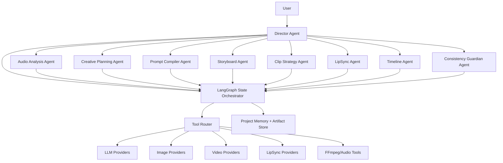
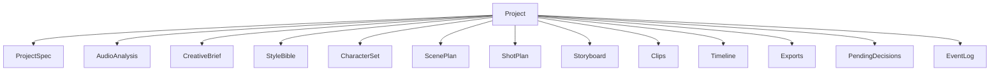
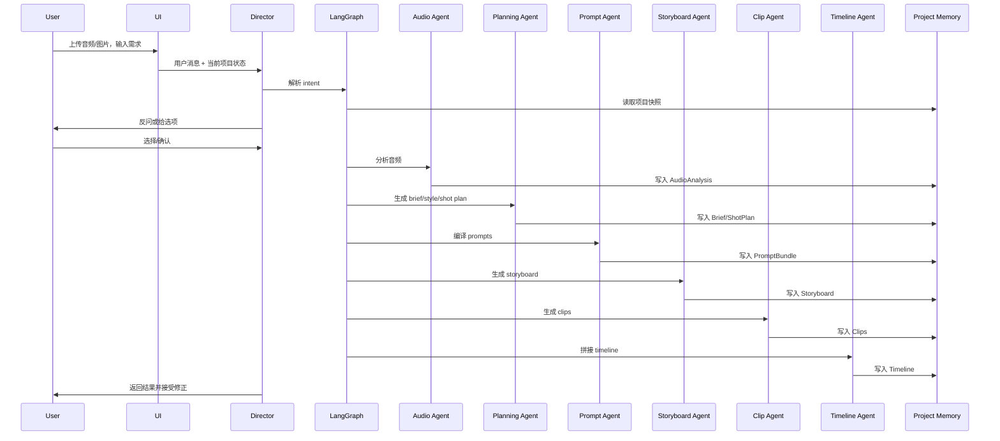

# AI Music Video Agent V1 架构设计文档

> 文档目标：给架构师、产品和开发直接使用。重点回答：`LangChain 还是 LangGraph`、多 Agent 怎么搭、项目级记忆怎么设计、入口到成片怎么串、各阶段由谁负责、如何回退、如何扩展。
>
> 文档时间：2026-03-27

---

## 1. 结论先行

如果要做一个**可上线、可扩展、不是只跑 demo** 的 `VidMuse` 类产品，第一版我建议：

- **采用 `LangGraph` 作为 Agent 编排框架**
- **采用 `LangChain` 作为模型/工具接入层，而不是主编排层**
- **架构上采用“受控多 Agent”**
- **主记忆采用“项目级记忆”**
- **用户级只保留很薄的偏好，不承载创作事实**
- **所有 Agent 通过结构化状态和结构化工单协作，不通过自由聊天协作**

一句话总结：

> 用 `LangGraph` 管状态、流程、持久化、人工确认和多 Agent 协作；用 `LangChain` 管模型调用、工具封装和 provider 适配。

---

## 2. 为什么不是纯 LangChain

截至 **2026 年 3 月 27 日**，官方文档对两者的定位已经很明确：

- `LangChain` 适合快速构建 agent 和工具调用循环
- `LangGraph` 适合需要 **deterministic + agentic workflows**、更强控制、持久化、人工介入、长流程和复杂状态的系统  

官方文档还明确说 `LangChain agents are built on top of LangGraph`，而 `LangGraph` 是更底层的 orchestration/runtime。  
来源：
- LangChain Overview: <https://docs.langchain.com/oss/python/langchain/overview>
- LangGraph Overview: <https://docs.langchain.com/oss/python/langgraph/overview>

这个产品天然就需要：

- 多阶段状态机
- 长任务
- 人工确认
- 中间产物版本化
- 多 Agent 协作
- 失败恢复
- 持久化执行

所以它不是一个“简单工具调用 agent”，而是一个**长生命周期、有强状态的创作系统**。这正是 `LangGraph` 的适配场景。

---

## 3. 技术选型结论

### 3.1 Agent 框架

**推荐：`LangGraph v1.x`**

截至 **2026-03-27**，PyPI 最新稳定版可见为：

- `langgraph==1.0.10`，发布日期 **2026-02-27**

来源：
- PyPI: <https://pypi.org/project/langgraph/>
- 官方概览：<https://docs.langchain.com/oss/python/langgraph/overview>

### 3.2 工具与模型接入层

**推荐：`LangChain 1.x` 作为 integration layer**

截至 **2026-03-27**，PyPI 最新稳定版可见为：

- `langchain==1.2.12`，发布日期 **2026-03-11**
- `langchain-openai==1.1.11`，发布日期 **2026-03-09**

来源：
- PyPI: <https://pypi.org/project/langchain/>
- PyPI: <https://pypi.org/project/langchain-openai/>

### 3.3 可观测性

**推荐：`LangSmith`**

截至 **2026-03-27**，PyPI 最新可见为：

- `langsmith==0.7.16`，发布日期 **2026-03-09**

来源：
- PyPI: <https://pypi.org/project/langsmith/>

### 3.4 我会如何落版本

第一版建议直接固定到：

```txt
langgraph==1.0.10
langchain==1.2.12
langchain-openai==1.1.11
langsmith==0.7.16
```

不要用太旧版本，也不要用 pre-release。

---

## 4. 为什么我最终选 LangGraph

### 4.1 这个产品不是单轮 agent

这个产品至少包含以下流程：

- 创建项目
- 上传音频
- 选择时间区间
- 音频分析
- 歌词时间对齐
- 生成 brief
- 生成风格方案
- 生成 scene/shot plan
- 生成 storyboard
- 生成 clips
- 拼时间线
- 局部返工
- 导出

这不是简单的“模型决定要不要调一个工具”。  
这是**有向流程 + 循环修正 + 人工确认 + 失败恢复 + 长任务执行**。

### 4.2 LangGraph 更适合的原因

我选 `LangGraph` 主要不是因为它“更高级”，而是因为它更适合这类系统的 6 个硬需求：

- **Stateful**：项目状态和图执行状态要持久化
- **Durable execution**：长流程中断后能恢复
- **Human-in-the-loop**：某些步骤必须等用户确认
- **Multi-actor**：主导演 Agent 和专业 Agent 分工
- **Replayability**：出错后要能回放和排查
- **Fine-grained control**：对每个节点的输入输出可控

### 4.3 LangChain 在这里怎么用

我不会抛弃 LangChain。  
我会这样用：

- `LangGraph`：图编排、状态机、节点流转、持久化、人工确认
- `LangChain`：模型封装、tool schema、structured output、provider integration

换句话说：

> `LangGraph` 管流程  
> `LangChain` 管调用

---

## 5. 第一版是否做多 Agent

你的判断是对的：**如果目标是未来可扩展，不想后面推翻重来，第一版就应该采用多 Agent 架构。**

但必须强调：

> 不是“自由聊天式多 Agent”，而是“受控多 Agent”。

### 5.1 什么叫受控多 Agent

- 只有一个主 Agent 对用户说话
- 其他 Agent 不直接对用户暴露
- Agent 之间传递结构化任务，不传自由文本长对话
- 所有 Agent 都受统一状态机约束
- 所有 Agent 都不能直接乱写数据库

### 5.2 为什么不做单 Agent

单 Agent 的问题在这个项目里会很快暴露：

- prompt 会越来越大
- 职责混在一起
- 很难分别优化“分析、规划、生成、质检”
- 调试困难
- 失败定位困难
- 后续升级多模态和新工具时易崩

### 5.3 为什么也不能做自由多 Agent

自由多 Agent 的问题是：

- 很难同步上下文
- 容易相互传错信息
- 成本更高
- 行为不可预测

所以正确方向是：

> **多 Agent 架构 + 中央导演 Agent + 统一项目状态 + 统一工单协议**

---

## 6. 多 Agent 架构总图



---

## 7. Agent 职责划分

### 7.1 Director Agent

这是唯一直接面向用户的 Agent。

职责：

- 读取当前项目状态
- 理解用户输入
- 判断缺失字段
- 决定是否反问
- 给结构化选项
- 决定派发哪个专业 Agent
- 汇总结果返回给用户
- 在高成本操作前请求确认

它不做：

- 直接生成媒体
- 直接改数据库
- 绕过状态机

### 7.2 Audio Analysis Agent

职责：

- BPM / beat 分析
- section segmentation
- 歌词时间对齐
- 情绪曲线分析
- 高潮点标注
- 生成“音乐结构摘要”

输出是结构化分析结果，不是散文。

### 7.3 Creative Planning Agent

职责：

- 生成 creative brief
- 生成 style direction
- 生成 scene list
- 生成 shot list
- 决定 narrative/performance/atmosphere 比例
- 标记哪些镜头可能需要 lipsync

### 7.4 Prompt Compiler Agent

这个 Agent 必须单独存在。

职责：

- 将 brief、style、character、scene、shot 编译成不同模型可用 prompt
- 输出正向 prompt、负向 prompt、约束参数
- 根据 provider 差异适配参数
- 确保全局风格与局部镜头同时成立

这个 Agent 的价值非常大，因为后续换 provider 时，业务层不需要重写。

### 7.5 Storyboard Agent

职责：

- 生成 storyboard frames
- 对齐角色和风格参考
- 做低成本视觉预演
- 给 clip 生成阶段提供关键帧基础

### 7.6 Clip Strategy Agent

职责：

- 判断某个 shot 应该走 `image-to-video`、`text-to-video` 还是 `video-to-video`
- 选择 provider
- 选择分辨率、时长、模式
- 输出生成工单

### 7.7 LipSync Agent

职责：

- 判断哪些镜头适合口型
- 切歌词片段音频
- 准备正脸人物素材
- 调用 lipsync provider
- 输出演唱镜头 clip

### 7.8 Timeline Agent

职责：

- 拼接 clips
- 对齐节拍
- 加字幕
- 加转场
- 生成 preview
- 生成 export 工单

### 7.9 Consistency Guardian Agent

第一版可以简化，但架构必须预留。

职责：

- 检查角色一致性
- 检查风格一致性
- 检查镜头节奏漂移
- 标记异常镜头

---

## 8. 主记忆到底怎么设计

这里我给你明确结论：

> **主记忆必须是项目级。**

不是用户级。

### 8.1 为什么必须是项目级

创作事实都属于项目：

- 当前歌曲
- 当前时间片段
- 当前 brief
- 当前风格
- 当前角色
- 当前 scene/shot plan
- 当前 storyboard
- 当前 clip 版本
- 当前 timeline

这些都不能跨项目共享。

### 8.2 用户级记忆能不能有

可以有，但必须非常薄。

只放这些：

- 默认语言
- 默认比例
- 默认导出分辨率
- 常用风格标签

不要把创作事实挂到用户级。

### 8.3 会话级记忆是什么

会话级只放短期交互状态：

- 最近提到哪个 shot
- 当前待确认动作
- 最近给过哪些选项
- 最近用户点了哪个选项

### 8.4 执行快照是什么

每次任务执行前，都从项目级 memory 切一个执行快照：

- 当前 active brief
- 当前 active style
- 当前 active shot plan
- 当前 active references
- 当前 provider 配置

这样任务重放和故障定位才稳定。

---

## 9. 项目级记忆结构



### 9.1 核心原则

- 每类对象都版本化
- 项目只存 active 指针
- Agent 读取的是“当前 active 版本 + 必要历史”
- 回退只是切换 active 指针

---

## 10. 多 Agent 之间如何通信

这里必须**禁用自由文本互聊**。  
Agent 之间只能传结构化工单。

### 10.1 标准工单协议

```json
{
  "task_id": "task_001",
  "task_type": "generate_shot_plan",
  "project_id": "proj_123",
  "requested_by": "director_agent",
  "input_refs": {
    "project_spec_version": "ps_v1",
    "audio_analysis_version": "aa_v2",
    "brief_version": "brief_v3",
    "style_bible_version": "style_v2"
  },
  "constraints": {
    "max_shots": 14,
    "target_duration_sec": 30,
    "performance_ratio": 0.4
  }
}
```

### 10.2 标准返回协议

```json
{
  "task_id": "task_001",
  "status": "success",
  "artifact_type": "shot_plan",
  "artifact_version": "shot_plan_v5",
  "warnings": [
    "chorus pacing is dense"
  ],
  "requires_confirmation": false
}
```

### 10.3 好处

- 可追踪
- 可回放
- 可缓存
- 可重试
- 可做幂等

---

## 11. LangGraph 在这里怎么落

### 11.1 总体策略

我不会把每个 Agent 做成完全独立的微服务。  
第一版建议：

- `一个 LangGraph 主图`
- 图里有多个 agent nodes
- 通过 shared state + explicit state keys 通信

### 11.2 顶层 Graph

顶层 graph 节点建议：

- `director_intake`
- `clarify_or_confirm`
- `audio_analysis_node`
- `creative_planning_node`
- `prompt_compile_node`
- `storyboard_node`
- `clip_strategy_node`
- `lipsync_node`
- `timeline_node`
- `consistency_review_node`
- `human_confirmation_gate`
- `tool_execution_node`
- `persist_artifacts_node`
- `respond_to_user_node`

### 11.3 为什么不是 DAG

因为这个系统天然有循环：

- 用户看完 storyboard 后继续改 style
- 用户看完 clips 后改单个 shot
- 用户导出前回退到旧版本

这就是 `LangGraph` 合适的原因。

### 11.4 Graph State 建议

```python
class ProjectGraphState(TypedDict):
    user_id: str
    project_id: str
    conversation_id: str
    current_stage: str
    user_message: str
    selected_entities: dict
    project_snapshot: dict
    pending_questions: list
    pending_options: list
    planned_actions: list
    tool_jobs: list
    last_agent_outputs: dict
    warnings: list
    requires_confirmation: bool
    estimated_credits: int | None
```

---

## 12. 多 Agent + LangGraph 的分层

我建议分 4 层：

### 12.1 Layer 1: Conversation Layer

负责：

- 接收用户输入
- 展示 UI
- 渲染选项和确认卡片

### 12.2 Layer 2: Agent Orchestration Layer

由 `LangGraph` 驱动：

- Director Agent
- 专业 Agent
- 状态流转
- 人工确认节点

### 12.3 Layer 3: Tool Execution Layer

负责真正调用：

- 音频分析工具
- 图像模型
- 视频模型
- lipsync provider
- ffmpeg

### 12.4 Layer 4: Artifact + Memory Layer

负责：

- 项目级 memory
- artifact versioning
- audit trail
- event log

---

## 13. 技术栈建议

### 13.1 后端

- `Python 3.11`
- `FastAPI`
- `LangGraph 1.0.10`
- `LangChain 1.2.12`
- `langchain-openai 1.1.11`
- `Pydantic 2.x`
- `SQLAlchemy 2.x`
- `PostgreSQL`
- `Redis`
- `Celery` 或 `RQ`

### 13.2 为什么 Python 3.11

- 生态成熟
- 与 LangGraph / LangChain / 音频分析库兼容好
- 比 3.10 更新，比 3.12/3.13 风险更低

### 13.3 前端

- `Next.js`
- `TypeScript`
- `Tailwind CSS`
- `shadcn/ui`
- `WaveSurfer.js`
- `React Flow` 或自定义 pipeline 可视化

### 13.4 媒体处理

- `ffmpeg`
- `librosa`
- `WhisperX`
- `Pillow`
- `OpenCV`

### 13.5 观测

- `LangSmith`
- `Sentry`
- `OpenTelemetry`

---

## 14. 模型是不是必须多模态

结论：

> **主导演 Agent 建议多模态。**
> **不是所有 Agent 都必须多模态。**

### 14.1 必须多模态的 Agent

#### Director Agent

原因：

- 用户会上传参考图
- 用户会基于 storyboard 说“这个不对”
- 用户可能圈图、选图、比较图

它需要看图。

#### Storyboard Agent

它需要看参考图和已有分镜结果，判断一致性和构图。

#### Consistency Guardian Agent

它需要检查图像和视频帧的一致性，适合多模态。

### 14.2 不一定必须多模态的 Agent

- Audio Analysis Agent
- Creative Planning Agent
- Prompt Compiler Agent
- Timeline Agent

这些可以主要吃结构化数据和文本。

### 14.3 第一版的现实做法

- 主导演 Agent：多模态大模型
- 视觉相关 Agent：可先复用同一个多模态模型
- 其他 Agent：普通强文本模型即可

这样成本更可控。

---

## 15. 入口到成片的完整链路

### 15.1 用户入口

第一版只支持：

- `音频 + 文本`
- `音频 + 图片 + 文本`

### 15.2 主链路时序



---

## 16. 单 Agent 如何处理多个阶段，为什么这里仍然建议多 Agent

你问得很准确：  
单 Agent 理论上也能处理多个阶段，因为上下文够大。

但工程上它会遇到 5 个问题：

- 单个 prompt 太肥
- 不同阶段规则混在一起
- 很难局部优化
- 调试困难
- 出错后难定位责任边界

多 Agent 的价值不在“更智能”，而在：

- **职责边界清楚**
- **可替换**
- **可单独评估**
- **可单独调 prompt**
- **便于升级**

所以从长期架构看，我仍然建议多 Agent。

---

## 17. 对话修正怎么实现

### 17.1 用户修正不是直接改 prompt

用户说：

> Shot 8 太慢了，保留这个女生，把副歌做得更炸一点。

系统流程应是：

1. Director Agent 识别 intent = `revise_shot`
2. 从项目 memory 读取 `shot_8`
3. 读取当前角色绑定
4. 读取当前 section 类型
5. 生成结构化 patch
6. 估算 credits
7. 用户确认
8. 派发给 Prompt Compiler Agent + Clip Strategy Agent
9. 更新新版本 clip
10. Timeline Agent 局部替换片段

### 17.2 修正必须变成 patch

```json
{
  "target": "shot_8",
  "patch": {
    "pacing": "faster",
    "energy": "high",
    "preserve_character_binding": true
  },
  "impact_scope": ["prompt_bundle", "clip", "timeline_segment"]
}
```

---

## 18. 反问机制怎么做

反问不能靠 Agent 自由发挥，必须有**缺失字段检查器**。

### 18.1 创建项目时的必填项

- 是否上传音频
- 是否选时间区间
- 输出时长
- 风格方向

### 18.2 推荐项

- 是否上传角色参考图
- 是否需要 lipsync 镜头
- 偏 narrative 还是 performance

### 18.3 反问顺序

优先问会阻塞流程的字段：

1. 音频区间
2. 输出时长
3. 风格方向
4. 是否锁定角色
5. 是否需要演唱镜头

---

## 19. 选项机制怎么做

Agent 不应该只给自然语言建议。  
必须输出结构化 options。

### 19.1 选项对象

```json
{
  "option_set_type": "style_direction",
  "options": [
    {
      "id": "style_a",
      "title": "电影胶片",
      "summary": "慢镜头、低饱和、情绪化"
    },
    {
      "id": "style_b",
      "title": "赛博夜景",
      "summary": "高对比、快节奏、副歌冲击强"
    }
  ]
}
```

### 19.2 前端呈现

前端要把它渲染成：

- 可点击卡片
- 显示成本差异
- 显示适合的段落类型

### 19.3 记录方式

用户点击后，项目 memory 应记录：

- `selected_option_id`
- `selection_reason`
- `selected_at`

---

## 20. 状态机设计

多 Agent 并不替代状态机。  
状态机反而更重要。

### 20.1 项目状态机

- `created`
- `input_ready`
- `audio_analyzed`
- `brief_ready`
- `shot_plan_ready`
- `storyboard_ready`
- `clips_ready`
- `timeline_ready`
- `export_ready`

### 20.2 任务状态机

- `pending`
- `running`
- `waiting_human`
- `succeeded`
- `failed`
- `retrying`
- `cancelled`

### 20.3 Shot 状态机

- `planned`
- `storyboard_ready`
- `clip_generating`
- `clip_ready`
- `approved`
- `stale`

### 20.4 失效规则

- 改音频区间：shot plan 之后全部失效
- 改全局风格：storyboard、clip、timeline 失效
- 改单个 shot：仅该 shot 相关 clip 与 timeline segment 失效

---

## 21. 回退和失败恢复

这是 `LangGraph` 的核心价值之一。

### 21.1 回退

回退不恢复整库，只切换：

- active brief version
- active style version
- active shot plan version
- active clip version
- active timeline version

### 21.2 失败恢复

如果 clip 生成失败：

- 保存失败工单
- 自动重试 1 到 2 次
- 仍失败则切备用 provider
- 仍失败则返回 Director Agent，请求用户调整

### 21.3 Durable execution

对于：

- 长任务
- 等用户确认
- 中途中断

要依赖 LangGraph 的持久化与恢复机制。  
官方文档明确将 durable execution 作为重点能力。  
来源：
- <https://docs.langchain.com/oss/python/langgraph/durable-execution>

---

## 22. 最终推荐架构

### 22.1 你应该怎么拍板

我建议你现在就定：

- **编排框架：`LangGraph 1.0.10`**
- **工具与模型接入：`LangChain 1.2.12`**
- **OpenAI 集成：`langchain-openai 1.1.11`**
- **可观测性：`LangSmith 0.7.16`**
- **架构模式：受控多 Agent**
- **主记忆：项目级**
- **前端：Next.js**
- **后端：FastAPI + Python 3.11**
- **状态核心：Project State + Task State + Shot State**

### 22.2 这套方案最适合你的原因

- 第一版就有扩展性
- 后面加 agent 不需要推翻架构
- 后面加 provider 不需要推翻业务层
- 后面做人工审核和版本回退很自然
- 能更好支撑对话式 pipeline UI

---

## 23. 开发落地顺序

### Phase 1：骨架

- 鉴权
- 项目体系
- 项目级 memory
- LangGraph 主图
- Director Agent
- 基础状态机

### Phase 2：音乐理解与规划

- Audio Analysis Agent
- Creative Planning Agent
- Prompt Compiler Agent

### Phase 3：视觉生成

- Storyboard Agent
- Clip Strategy Agent
- Provider adapters

### Phase 4：成片与修正

- Timeline Agent
- 局部修正 patch 流程
- 回退系统

### Phase 5：增强

- LipSync Agent
- Consistency Guardian Agent
- 更多 provider

---

## 24. 最后的架构判断

如果你问我一句最实在的话：

> 这类产品如果一开始就想做成真正能上线、能扩展、不是一次性 demo，应该选 `LangGraph`，并且采用“项目级记忆 + 受控多 Agent + 强状态机”的设计。

而不是：

- 纯 LangChain 单 agent
- 纯聊天上下文当记忆
- 多 agent 自由互聊

那几种方案前期看起来快，后面都会返工。

---

## 25. 参考资料

- LangChain Overview: <https://docs.langchain.com/oss/python/langchain/overview>
- LangGraph Overview: <https://docs.langchain.com/oss/python/langgraph/overview>
- LangGraph v1 文档页: <https://docs.langchain.com/oss/python/langgraph>
- LangGraph Durable Execution: <https://docs.langchain.com/oss/python/langgraph/durable-execution>
- LangChain PyPI: <https://pypi.org/project/langchain/>
- LangGraph PyPI: <https://pypi.org/project/langgraph/>
- langchain-openai PyPI: <https://pypi.org/project/langchain-openai/>
- LangSmith PyPI: <https://pypi.org/project/langsmith/>

