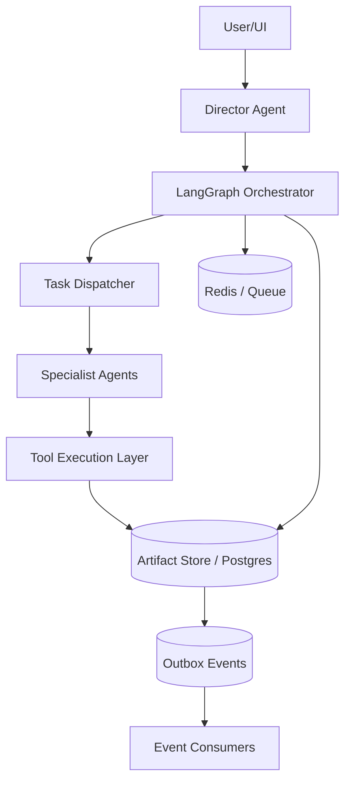
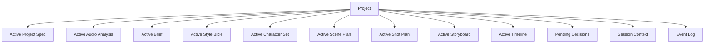

# AI Music Video Agent V1 数据库、消息传递与记忆系统设计文档

> 文档目标：定义多 Agent 架构下最关键的三部分基础设施：
> 1. 数据库模型
> 2. Agent/服务间消息传递协议
> 3. 项目级记忆系统
>
> 这份文档不是泛泛架构说明，而是给后续 `表结构设计`、`API 设计`、`LangGraph 状态设计`、`任务编排` 直接使用的基础规格。

---

## 1. 设计目标

这份设计要解决的核心问题：

- 多 Agent 如何共享同一项目事实而不串线
- 对话如何转成结构化任务
- 中间产物如何版本化、可回退、可追踪
- 长任务如何可恢复、可重试、可幂等
- 一个项目里的 brief、style、shot、storyboard、clip、timeline 如何关联
- 用户说“改第 8 个镜头”时，系统如何准确定位和传播修改
- Agent 间如何传递任务，不依赖自由文本聊天

---

## 2. 设计原则

### 2.1 单一事实源

项目的创作事实必须只有一个可信来源：

> `Project Memory Store`

所有 Agent 都从这里读事实，不能靠各自对话历史“记住”事实。

### 2.2 结构化优先

内部协议优先使用：

- 结构化对象
- 版本号
- 事件
- 工单

不要依赖自然语言长文本作为系统内部状态。

### 2.3 项目级记忆优先

创作事实以项目级为主，不以用户级为主。

用户级只保留很薄的偏好：

- 默认语言
- 默认比例
- 默认导出分辨率

### 2.4 事件驱动，但不纯事件溯源

第一版建议：

- 主数据存关系型数据库
- 关键操作产生日志事件
- 采用 Outbox 模式保证消息可靠投递

不建议第一版直接做纯 Event Sourcing。

### 2.5 所有重要对象都版本化

必须版本化的对象：

- `project_spec`
- `audio_analysis`
- `creative_brief`
- `style_bible`
- `character_set`
- `scene_plan`
- `shot_plan`
- `storyboard`
- `clip`
- `timeline`
- `export`

---

## 3. 总体分层



系统分四层：

- `交互层`
- `编排层`
- `执行层`
- `数据与记忆层`

---

## 4. 记忆系统设计

### 4.1 记忆分层

我建议严格分成四层。

#### A. 用户偏好记忆

作用：

- 保存很轻的全局偏好

内容：

- 默认语言
- 默认画幅比例
- 默认导出分辨率
- 常用风格标签

限制：

- 不存项目创作事实
- 不存镜头信息
- 不存角色设定

#### B. 项目工作记忆

这是系统主记忆，最重要。

内容：

- 当前项目输入规格
- 音频分析结果
- 当前 active brief
- 当前 active style bible
- 当前 active character set
- 当前 active scene/shot plan
- 当前 active storyboard
- 当前 active clips
- 当前 active timeline
- pending 决策
- 版本历史

#### C. 会话短期记忆

作用：

- 支持对话连续性

内容：

- 最近提到的 shot
- 当前等待确认的动作
- 最近展示给用户的 options
- 用户当前选中的对象

#### D. 执行快照记忆

作用：

- 保证任务执行可复现

内容：

- 某次任务所使用的 active 版本快照
- provider 配置
- prompt bundle
- tool 输入 hash

### 4.2 为什么项目级记忆是主记忆

因为系统的创作事实都属于具体项目：

- 一首具体歌
- 一段具体时间片段
- 一套具体角色
- 一套具体镜头
- 一条具体 timeline

这些都不能在项目之间混用。

### 4.3 项目记忆最小读取原则

每个 Agent 每次只读取自己需要的项目子集。

例如：

- Audio Agent 读 `project_spec + audio_assets`
- Planning Agent 读 `project_spec + audio_analysis + references`
- Prompt Agent 读 `brief + style + shot + refs`
- Timeline Agent 读 `clip_versions + beat_map + subtitles`

不要把整个项目所有历史全量塞给每个 Agent。

---

## 5. 项目记忆结构

### 5.1 项目主视图



### 5.2 项目 Memory Snapshot

建议每次图执行时生成一个标准化 snapshot：

```json
{
  "project_id": "proj_123",
  "active_versions": {
    "project_spec": "ps_v3",
    "audio_analysis": "aa_v1",
    "creative_brief": "brief_v2",
    "style_bible": "style_v4",
    "shot_plan": "sp_v3",
    "storyboard": "sb_v2",
    "timeline": "tl_v1"
  },
  "selected_entities": {
    "shot_id": "shot_008"
  },
  "pending_decisions": [
    {
      "decision_type": "confirm_clip_regeneration",
      "target_id": "shot_008"
    }
  ]
}
```

---

## 6. 数据库选型

### 6.1 主数据库

建议：

- `PostgreSQL`

原因：

- 关系复杂
- 版本化对象多
- 事务要求高
- 需要 JSONB 支持结构化 payload
- 适合事件 outbox 和 ledger 账本

### 6.2 缓存与队列

建议：

- `Redis`

用途：

- job queue
- graph checkpoint cache
- session 短期状态
- idempotency key 缓存

### 6.3 对象存储

建议：

- `MinIO`

存储：

- 音频
- 图像
- 视频
- 导出成片
- 中间帧

说明：

- 第一版优先使用 `MinIO`，便于本地开发、测试和私有部署
- 对象访问层统一封装为 `ObjectStorageAdapter`
- 后续可无业务层改动地替换为 `S3 / 阿里云 OSS`

---

## 7. 核心数据库模型

### 7.1 用户与鉴权

#### `users`

字段建议：

- `id`
- `username`
- `password_hash`
- `status`
- `created_at`
- `updated_at`

#### `user_preferences`

- `id`
- `user_id`
- `default_language`
- `default_aspect_ratio`
- `default_resolution`
- `favorite_style_tags` `jsonb`

### 7.2 项目与会话

#### `projects`

- `id`
- `user_id`
- `name`
- `status`
- `current_stage`
- `active_project_spec_version_id`
- `active_audio_analysis_version_id`
- `active_brief_version_id`
- `active_style_version_id`
- `active_character_set_version_id`
- `active_scene_plan_version_id`
- `active_shot_plan_version_id`
- `active_storyboard_version_id`
- `active_timeline_version_id`
- `created_at`
- `updated_at`

#### `conversation_sessions`

- `id`
- `project_id`
- `status`
- `last_selected_entity_type`
- `last_selected_entity_id`
- `pending_decision_id`
- `created_at`
- `updated_at`

#### `conversation_messages`

- `id`
- `session_id`
- `role`
- `message_type`
- `content_text`
- `content_json`
- `created_at`

`message_type` 建议包括：

- `user_text`
- `assistant_text`
- `assistant_options`
- `assistant_confirmation`
- `system_event_summary`

### 7.3 输入规格与资产

#### `project_spec_versions`

- `id`
- `project_id`
- `version_no`
- `input_mode`
- `audio_asset_id`
- `audio_start_sec`
- `audio_end_sec`
- `user_prompt`
- `output_config` `jsonb`
- `constraints` `jsonb`
- `created_by`
- `source_event_id`
- `is_active`
- `created_at`

#### `assets`

- `id`
- `project_id`
- `asset_type`
- `storage_uri`
- `mime_type`
- `duration_ms`
- `width`
- `height`
- `metadata` `jsonb`
- `created_at`

`asset_type` 建议包括：

- `audio_original`
- `audio_trimmed`
- `image_reference`
- `style_reference`
- `storyboard_frame`
- `clip_video`
- `export_video`

### 7.4 分析与规划

#### `audio_analysis_versions`

- `id`
- `project_id`
- `version_no`
- `audio_asset_id`
- `bpm`
- `beat_map` `jsonb`
- `section_map` `jsonb`
- `energy_curve` `jsonb`
- `lyrics_alignment` `jsonb`
- `raw_payload` `jsonb`
- `is_active`
- `created_at`

#### `creative_brief_versions`

- `id`
- `project_id`
- `version_no`
- `title`
- `summary`
- `narrative_mode`
- `performance_ratio`
- `mood_tags` `jsonb`
- `style_direction`
- `raw_payload` `jsonb`
- `is_active`
- `created_at`

#### `style_bible_versions`

- `id`
- `project_id`
- `version_no`
- `palette`
- `lighting_style`
- `camera_style`
- `film_texture`
- `reference_notes`
- `raw_payload` `jsonb`
- `is_active`
- `created_at`

#### `character_set_versions`

- `id`
- `project_id`
- `version_no`
- `raw_payload` `jsonb`
- `is_active`
- `created_at`

#### `scene_plan_versions`

- `id`
- `project_id`
- `version_no`
- `raw_payload` `jsonb`
- `is_active`
- `created_at`

#### `shot_plan_versions`

- `id`
- `project_id`
- `version_no`
- `raw_payload` `jsonb`
- `is_active`
- `created_at`

### 7.5 Shot 实体

虽然 `shot_plan_versions` 可以存全量 JSON，但仍建议落一张标准化 shot 表。

#### `shots`

- `id`
- `project_id`
- `shot_plan_version_id`
- `scene_id`
- `shot_index`
- `start_ms`
- `end_ms`
- `duration_ms`
- `section_type`
- `lyric_text`
- `emotion`
- `shot_type`
- `camera_language`
- `visual_energy`
- `lipsync_required`
- `character_binding` `jsonb`
- `style_binding` `jsonb`
- `status`
- `created_at`

### 7.6 Storyboard 与 Clips

#### `storyboard_versions`

- `id`
- `project_id`
- `version_no`
- `shot_plan_version_id`
- `raw_payload` `jsonb`
- `is_active`
- `created_at`

#### `storyboard_frames`

- `id`
- `project_id`
- `storyboard_version_id`
- `shot_id`
- `asset_id`
- `prompt_bundle_id`
- `frame_index`
- `metadata` `jsonb`

#### `clip_versions`

- `id`
- `project_id`
- `shot_id`
- `version_no`
- `provider`
- `generation_mode`
- `asset_id`
- `duration_ms`
- `prompt_bundle_id`
- `quality_score`
- `status`
- `is_active`
- `created_at`

### 7.7 Prompt 与时间线

#### `prompt_bundles`

- `id`
- `project_id`
- `target_type`
- `target_id`
- `provider`
- `positive_prompt`
- `negative_prompt`
- `params` `jsonb`
- `created_at`

`target_type` 包括：

- `storyboard_frame`
- `shot_clip`
- `lipsync_clip`

#### `timeline_versions`

- `id`
- `project_id`
- `version_no`
- `audio_asset_id`
- `subtitle_track` `jsonb`
- `render_status`
- `raw_payload` `jsonb`
- `is_active`
- `created_at`

#### `timeline_segments`

- `id`
- `timeline_version_id`
- `shot_id`
- `clip_version_id`
- `start_ms`
- `end_ms`
- `transition_in`
- `transition_out`
- `metadata` `jsonb`

### 7.8 导出与计费

#### `export_versions`

- `id`
- `project_id`
- `timeline_version_id`
- `asset_id`
- `resolution`
- `status`
- `created_at`

#### `credit_ledger`

- `id`
- `user_id`
- `project_id`
- `job_id`
- `entry_type`
- `tool_name`
- `units`
- `unit_price`
- `delta`
- `status`
- `metadata` `jsonb`
- `created_at`

`entry_type` 包括：

- `reserve`
- `commit`
- `refund`
- `grant`

---

## 8. Agent 与任务模型

### 8.1 Agent 不直接写业务对象

必须明确：

- Agent 输出 `plan`
- Service 层负责落库
- Tool 层负责执行
- 状态机负责合法性判断

### 8.2 Agent 任务表

#### `agent_tasks`

- `id`
- `project_id`
- `conversation_session_id`
- `task_type`
- `requested_by_agent`
- `assigned_agent`
- `status`
- `input_ref` `jsonb`
- `output_ref` `jsonb`
- `error_payload` `jsonb`
- `created_at`
- `updated_at`

`status` 建议：

- `pending`
- `running`
- `waiting_human`
- `succeeded`
- `failed`
- `cancelled`

### 8.3 Tool 任务表

#### `tool_jobs`

- `id`
- `project_id`
- `agent_task_id`
- `tool_name`
- `provider`
- `status`
- `input_payload` `jsonb`
- `output_payload` `jsonb`
- `idempotency_key`
- `retry_count`
- `created_at`
- `updated_at`

---

## 9. 消息传递设计

### 9.1 为什么要显式消息层

因为这是多 Agent 架构，不做显式消息设计，会出现：

- 任务谁发起不清楚
- 谁消费不清楚
- 失败无法恢复
- 图执行无法追踪

### 9.2 消息分三类

#### A. Command

表示“去做一件事”。

例如：

- `GenerateShotPlanCommand`
- `GenerateStoryboardCommand`
- `RegenerateClipCommand`

#### B. Event

表示“某件事已经发生”。

例如：

- `AudioAnalysisCompleted`
- `StoryboardGenerated`
- `ClipGenerationFailed`

#### C. DecisionRequest

表示“需要用户确认或选择”。

例如：

- `ConfirmRegenerateShot`
- `SelectStyleDirection`

### 9.3 消息总线选型

第一版建议：

- `Redis + DB Outbox`

原因：

- 实现简单
- 足够支撑 MVP
- 与 Postgres 配合容易

不建议第一版就上 Kafka。

---

## 10. Outbox 模式

### 10.1 为什么必须做

典型问题：

- 数据库更新成功
- 事件发送失败

如果没有 outbox，会导致状态和消息不一致。

### 10.2 表设计

#### `outbox_events`

- `id`
- `aggregate_type`
- `aggregate_id`
- `event_type`
- `payload` `jsonb`
- `status`
- `available_at`
- `published_at`
- `created_at`

### 10.3 工作流

1. Service 在同一个 DB 事务里：
   - 写业务数据
   - 写 outbox event
2. 后台 publisher 扫描 `outbox_events`
3. 发布到 Redis stream / queue
4. 成功后标记 `published`

---

## 11. Agent 间标准消息协议

### 11.1 通用 Envelope

```json
{
  "message_id": "msg_001",
  "message_type": "command",
  "command_name": "generate_shot_plan",
  "project_id": "proj_123",
  "conversation_session_id": "sess_001",
  "source_agent": "director_agent",
  "target_agent": "creative_planning_agent",
  "correlation_id": "corr_001",
  "causation_id": "evt_001",
  "payload": {},
  "created_at": "2026-03-27T10:00:00Z"
}
```

### 11.2 典型 Command

#### `generate_shot_plan`

```json
{
  "payload": {
    "project_snapshot_ref": "snap_001",
    "constraints": {
      "target_duration_sec": 30,
      "max_shots": 14,
      "performance_ratio": 0.4
    }
  }
}
```

#### `compile_prompt_bundle`

```json
{
  "payload": {
    "shot_ids": ["shot_001", "shot_002"],
    "provider": "provider_a",
    "use_style_lock": true,
    "use_character_lock": true
  }
}
```

### 11.3 典型 Event

#### `shot_plan_generated`

```json
{
  "payload": {
    "shot_plan_version_id": "sp_v3",
    "shot_count": 12,
    "warnings": []
  }
}
```

#### `clip_generation_failed`

```json
{
  "payload": {
    "shot_id": "shot_008",
    "provider": "provider_x",
    "error_code": "timeout",
    "retryable": true
  }
}
```

---

## 12. 对话到任务的桥接

### 12.1 内部桥接层

需要一个 `Intent Resolution Service`。

输入：

- 用户消息
- 当前项目 memory snapshot
- 当前 session context

输出：

- `intent`
- `target_entity`
- `patch`
- `requires_confirmation`
- `estimated_cost`
- `next_command`

### 12.2 例子

用户说：

> Shot 8 太慢了，保留这个女生，但副歌更炸一点。

系统输出：

```json
{
  "intent": "revise_shot",
  "target_entity": {
    "type": "shot",
    "id": "shot_008"
  },
  "patch": {
    "pacing": "faster",
    "energy": "high",
    "preserve_character_binding": true
  },
  "impact_scope": [
    "prompt_bundle",
    "clip_version",
    "timeline_segment"
  ],
  "requires_confirmation": true,
  "next_command": "regenerate_clip"
}
```

---

## 13. Session 短期上下文设计

### 13.1 为什么单独做

因为项目记忆是长期事实，session 是短期交互状态，两者必须分开。

### 13.2 Session Context 内容

#### `session_contexts`

- `session_id`
- `project_id`
- `selected_entity_type`
- `selected_entity_id`
- `pending_option_set_id`
- `pending_confirmation_id`
- `recent_agent_summary` `jsonb`
- `updated_at`

### 13.3 使用场景

- 用户说“这个镜头”
- 用户说“保留上一个人物”
- 用户点击某个 option 卡片

这些短期指代应该先落 session context，再转成项目级变更。

---

## 14. Pending Decision 设计

### 14.1 为什么必须有

因为系统中有很多步骤需要用户确认：

- 重生成是否扣费
- 风格方案选哪个
- 是否启用 lipsync
- 是否接受一致性质检警告

### 14.2 表设计

#### `pending_decisions`

- `id`
- `project_id`
- `session_id`
- `decision_type`
- `target_entity_type`
- `target_entity_id`
- `options_payload` `jsonb`
- `default_option_id`
- `status`
- `expires_at`
- `created_at`

### 14.3 决策状态

- `open`
- `selected`
- `expired`
- `cancelled`

---

## 15. 版本与回退设计

### 15.1 版本策略

所有版本对象都遵循：

- 插入新版本
- 不覆盖旧版本
- 项目表上维护 active 指针

### 15.2 回退流程

如果用户要回退 style：

1. 切换 `projects.active_style_version_id`
2. 触发失效规则
3. 标记 storyboard、clip、timeline 为 `stale`
4. 创建 pending regeneration decision

### 15.3 `stale` 标记

建议所有衍生对象都支持：

- `fresh`
- `stale`
- `rebuilding`

---

## 16. 幂等与恢复

### 16.1 幂等键

所有高成本 tool job 必须带：

- `idempotency_key = hash(tool_name + input_payload + provider + project_active_versions)`

### 16.2 恢复

如果图执行中断：

- 从 LangGraph checkpoint 恢复
- 从 `project snapshot` 恢复 active context
- 从 `tool_jobs` 恢复未完成任务状态

### 16.3 为什么要双恢复

LangGraph checkpoint 解决图状态，数据库解决业务事实。  
两者都需要。

---

## 17. 建议的索引

### 17.1 高频索引

- `projects(user_id, updated_at desc)`
- `conversation_messages(session_id, created_at)`
- `shots(project_id, shot_index)`
- `clip_versions(shot_id, is_active)`
- `timeline_segments(timeline_version_id, shot_id)`
- `outbox_events(status, available_at)`
- `tool_jobs(idempotency_key)`
- `agent_tasks(project_id, status)`

### 17.2 JSONB 索引

对高频过滤的 JSONB 字段做 GIN 索引，例如：

- `project_spec_versions.constraints`
- `pending_decisions.options_payload`
- `tool_jobs.input_payload`

---

## 18. 第一版不要做的复杂设计

为了保证 MVP 可做，第一版不要做：

- 纯 Event Sourcing
- Kafka
- 多租户组织级共享记忆
- 每个 Agent 独立数据库
- 每个 Agent 独立向量库
- 长期自由文本 memory retrieval

第一版应该做的是：

- Postgres 主库
- Redis 队列
- 项目级结构化 memory
- Outbox
- 版本化 artifact
- Session context

---

## 19. 最终建议

如果现在要先把底层定义好，我建议你直接拍板这几个核心结论：

- 主数据库用 `Postgres`
- 队列与缓存用 `Redis`
- 对象存储用 `MinIO`，后续可替换为 `S3 / 阿里云 OSS`
- 主记忆是 `Project Memory`
- 用户级只保留轻偏好
- 会话级单独保存短期上下文
- Agent 间通信必须结构化
- 业务数据与事件用 Outbox 保证一致性
- 所有中间产物版本化
- 项目表维护 active 版本指针

这套定义一旦定下来，后面才能继续细化：

- API
- LangGraph state
- Agent prompt
- Tool schema
- 前端状态同步

---

## 20. 下一步应该继续写什么

基于这份文档，下一步最应该落的两份规格是：

- `vidmuse_state_machine_and_event_spec.md`
- `vidmuse_table_schema_and_api_fields.md`

前者定义：

- 项目状态机
- Task 状态机
- Shot 状态机
- 事件列表
- 失效规则

后者定义：

- 每张表的字段类型
- 外键
- 唯一约束
- API request/response schema
