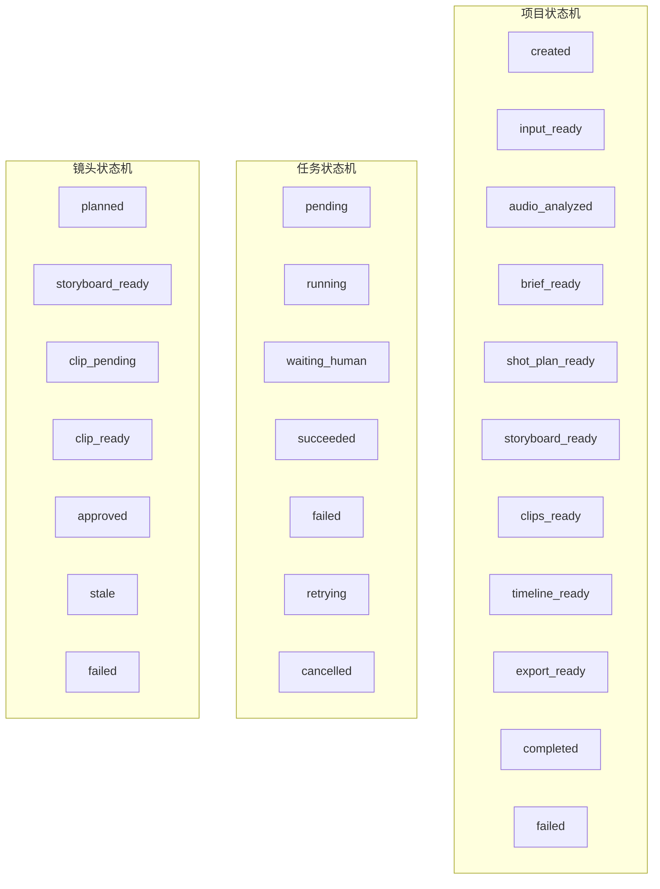
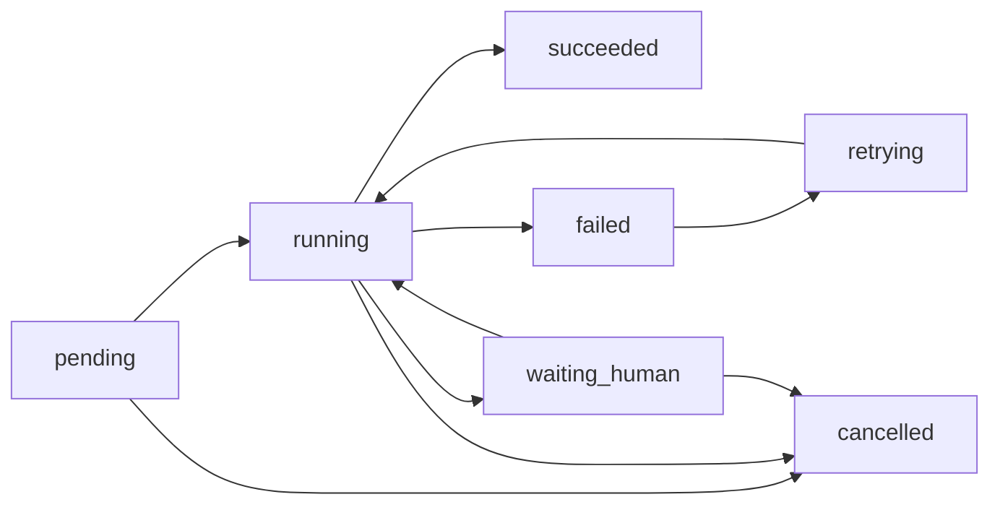
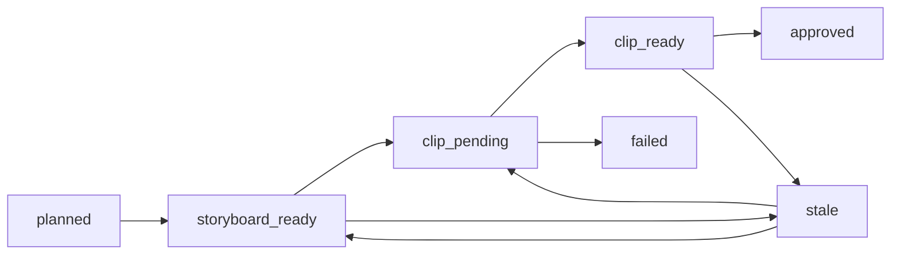

# VidMuse 状态机与事件流规范

> 文档目标：定义多 Agent 架构下的状态系统、事件系统、失效规则、人工确认节点、回退规则和跨模块流转规范。
>
> 这份文档直接服务于：
> - `LangGraph` 图设计
> - 后端状态校验
> - 多 Agent 协同约束
> - Tool 执行触发条件
> - 前端 Pipeline 展示
> - 版本回退与局部返工

---

## 1. 文档定位

前面三份文档已经定义了：

- 产品定位与多 Agent 总体架构
- `LangGraph` 作为编排框架
- 项目级记忆、数据库、消息协议

这份文档要继续解决一个更硬的问题：

> 在一个“对话式 + Pipeline + 多 Agent + 多 Tool”的系统里，哪些动作何时允许发生，发生后影响什么，失败后怎么恢复，用户确认卡在哪些节点上。

如果这一层不先定义好，后面会出现：

- Agent 越权执行
- 多轮修改影响范围不清
- Storyboard、Clip、Timeline 之间状态错乱
- 回退不可控
- 前后端对“当前阶段”的理解不一致

---

## 2. 设计原则

### 2.1 状态机是系统控制面，不是 UI 装饰

状态机必须作为后端核心规则存在，而不是只是前端显示一个流程条。

### 2.2 Agent 不能绕过状态机

任何 Agent 只能：

- 读取当前状态
- 提出动作
- 请求执行

是否允许执行，必须由状态机层决定。

### 2.3 状态分层

本系统至少需要三层状态机：

- `项目状态机`
- `任务状态机`
- `镜头状态机`

必要时可再加：

- `导出状态机`
- `决策状态机`

### 2.4 状态与版本分离

状态表示“当前所处阶段”和“是否可操作”。  
版本表示“当前产物是哪个版本”。

不要把版本号和状态混为一谈。

### 2.5 失效显式化

任何上游变更导致的下游失效，都必须显式标记为：

- `stale`
- `rebuilding`
- `fresh`

不能靠 Agent “心里知道”。

---

## 3. 状态机全景图



---

## 4. 项目状态机定义

### 4.1 项目状态枚举

#### `created`

项目刚创建，只完成最小初始化。

条件：

- 项目已存在
- 会话已创建
- 尚未满足输入要求

允许动作：

- 上传音频
- 上传参考图
- 填写 prompt
- 删除项目

禁止动作：

- 音频分析
- 生成 brief
- 生成 shot plan

#### `input_ready`

项目已具备进入主流程的最小输入条件。

条件：

- 已上传音频
- 已选定音频区间
- 已给出初始创意描述

允许动作：

- 音频分析
- 修改时间区间
- 上传/替换参考图
- 修改 prompt

#### `audio_analyzed`

音频结构分析完成。

条件：

- 已有 active `audio_analysis`

允许动作：

- 生成 brief
- 重新分析音频
- 修改音频区间并重新分析

#### `brief_ready`

创意 brief 和 style 方案至少有一版完成。

条件：

- 已有 active `creative_brief`
- 已有 active `style_bible`

允许动作：

- 生成 scene/shot plan
- 修改 brief
- 修改 style
- 生成参考图

#### `shot_plan_ready`

镜头计划已完成。

条件：

- 已有 active `scene_plan`
- 已有 active `shot_plan`

允许动作：

- 生成 storyboard
- 调整 shot 顺序
- 修改某个 shot
- 重新规划 shot plan

#### `storyboard_ready`

分镜和关键帧已完成。

条件：

- 已有 active `storyboard`

允许动作：

- 生成 clips
- 修改某个 storyboard frame
- 重做某个 shot 的 storyboard
- 回退到旧 storyboard 版本

#### `clips_ready`

至少已完成一轮可用片段生成。

条件：

- 所有必须生成的 shot 至少有 active clip

允许动作：

- 生成 timeline
- 局部重生成 clip
- 批量重生成部分 shot
- 发起一致性质检

#### `timeline_ready`

时间线和预览成片可用。

条件：

- 已有 active `timeline`
- preview 可播放

允许动作：

- 导出
- 局部替换片段
- 调整字幕
- 调整转场
- 回退 timeline 版本

#### `export_ready`

已通过导出前检查，可发起导出。

条件：

- timeline 为 `fresh`
- 所有必须素材可用
- 无阻塞决策未处理

允许动作：

- 导出预览版
- 导出高清版

#### `completed`

至少一次导出成功。

允许动作：

- 发起新导出
- 回退并继续修改
- 复制项目

#### `failed`

项目级主流程发生不可恢复失败。

允许动作：

- 查看错误
- 手动重试
- 回退到最近稳定版本

### 4.2 项目主状态流转

```mermaid
flowchart LR
    A[created] --> B[input_ready]
    B --> C[audio_analyzed]
    C --> D[brief_ready]
    D --> E[shot_plan_ready]
    E --> F[storyboard_ready]
    F --> G[clips_ready]
    G --> H[timeline_ready]
    H --> I[export_ready]
    I --> J[completed]

    C --> B
    D --> C
    E --> D
    F --> E
    G --> F
    H --> G
    I --> H
```



注意：

- 主状态可以后退，但不是“删除历史”，而是由于上游修改导致下游失效。
- `completed` 不是终态，项目可以继续编辑。

---

## 5. 任务状态机定义

任务状态机用于所有：

- Agent task
- Tool job
- 导出任务
- 长耗时媒体任务

### 5.1 任务状态枚举

#### `pending`

任务已创建，尚未执行。

#### `running`

任务正在执行。

#### `waiting_human`

任务需要用户确认、选择或补充信息。

#### `succeeded`

任务执行成功，并已落盘结果。

#### `failed`

任务执行失败，且当前无自动重试。

#### `retrying`

任务失败后，系统正在自动重试。

#### `cancelled`

任务被主动取消，例如：

- 用户修改了上游输入
- 用户主动终止
- 系统检测到该任务结果将失效

### 5.2 任务状态流转



### 5.3 自动重试规则

允许自动重试的错误：

- provider timeout
- network error
- transient quota error
- temporary decode/render error

不自动重试的错误：

- 缺失关键输入
- prompt 编译失败
- 状态非法
- 用户未确认

---

## 6. 镜头状态机定义

镜头状态机是这个产品最关键的局部状态机。

### 6.1 镜头状态枚举

#### `planned`

镜头已规划，但尚无 storyboard。

#### `storyboard_ready`

镜头已有可用 storyboard frame。

#### `clip_pending`

镜头正在等待视频生成或局部重生成。

#### `clip_ready`

镜头已有可用 active clip。

#### `approved`

镜头被用户或系统显式确认可用。

#### `stale`

由于上游修改，当前镜头结果已过期。

#### `failed`

该镜头相关任务失败，当前无可用结果。

### 6.2 镜头状态流转



### 6.3 镜头局部返工规则

当用户只修改一个 shot：

- 只把该 shot 标记为 `stale`
- 该 shot 的 active clip 设为非活跃，保留历史版本
- timeline 中对应 segment 标记 `stale`
- 项目主状态通常不回退到 `brief_ready`，而只影响 `timeline_ready/export_ready`

---

## 7. 决策状态机定义

由于系统包含大量人工确认节点，建议单独定义决策状态机。

### 7.1 决策状态枚举

- `open`
- `selected`
- `expired`
- `cancelled`

### 7.2 需要决策的典型场景

- 风格方案选择
- 是否启用 lipsync
- 重生成是否确认扣费
- 回退到旧版本后是否立即重建下游
- provider fallback 是否允许

---

## 8. 事件系统设计

### 8.1 事件分类

系统事件分为三类：

#### A. Domain Event

表示业务事实发生了变化。

例如：

- `project_input_ready`
- `audio_analysis_completed`
- `brief_generated`
- `shot_plan_generated`
- `clip_generated`
- `timeline_composed`

#### B. Workflow Event

表示流程上的状态变化。

例如：

- `agent_task_started`
- `agent_task_waiting_human`
- `tool_job_retrying`
- `tool_job_cancelled`

#### C. UI Event

表示需要前端感知的交互事件。

例如：

- `decision_requested`
- `timeline_became_stale`
- `project_stage_changed`

### 8.2 事件命名规范

建议统一采用过去式或状态变化式：

- `audio_analysis_requested`
- `audio_analysis_completed`
- `audio_analysis_failed`

这样有利于日志追踪和图执行回放。

---

## 9. 事件清单

### 9.1 项目级事件

- `project_created`
- `project_input_updated`
- `project_input_ready`
- `project_stage_changed`
- `project_failed`
- `project_completed`

### 9.2 音频分析事件

- `audio_uploaded`
- `audio_trimmed`
- `audio_analysis_requested`
- `audio_analysis_completed`
- `audio_analysis_failed`

### 9.3 规划事件

- `brief_generation_requested`
- `brief_generated`
- `style_bible_generated`
- `scene_plan_generated`
- `shot_plan_generated`
- `shot_plan_failed`

### 9.4 分镜事件

- `storyboard_generation_requested`
- `storyboard_generated`
- `storyboard_regenerated`
- `storyboard_failed`

### 9.5 视频片段事件

- `clip_generation_requested`
- `clip_generated`
- `clip_generation_failed`
- `clip_regenerated`
- `clip_marked_stale`

### 9.6 时间线事件

- `timeline_compose_requested`
- `timeline_composed`
- `timeline_segment_replaced`
- `timeline_marked_stale`

### 9.7 导出事件

- `export_requested`
- `export_completed`
- `export_failed`

### 9.8 决策事件

- `decision_requested`
- `decision_selected`
- `decision_expired`
- `decision_cancelled`

---

## 10. 命令系统设计

事件表示“已经发生”，命令表示“请求去做”。

### 10.1 命令清单

#### 项目命令

- `CreateProject`
- `UpdateProjectSpec`
- `SelectProjectInputRange`

#### 分析命令

- `RunAudioAnalysis`
- `ReRunAudioAnalysis`

#### 规划命令

- `GenerateBrief`
- `GenerateStyleBible`
- `GenerateScenePlan`
- `GenerateShotPlan`

#### 分镜命令

- `GenerateStoryboard`
- `RegenerateStoryboardFrame`

#### 视频命令

- `GenerateClip`
- `RegenerateClip`
- `GenerateLipSyncClip`

#### 时间线命令

- `ComposeTimeline`
- `ReplaceTimelineSegment`
- `GenerateSubtitles`

#### 导出命令

- `RenderPreview`
- `ExportVideo`

#### 决策命令

- `RequestDecision`
- `SubmitDecision`

---

## 11. 状态变更触发器

### 11.1 什么会推进项目主状态

| 触发事件 | 新状态 |
|---|---|
| `project_input_ready` | `input_ready` |
| `audio_analysis_completed` | `audio_analyzed` |
| `brief_generated` + `style_bible_generated` | `brief_ready` |
| `shot_plan_generated` | `shot_plan_ready` |
| `storyboard_generated` | `storyboard_ready` |
| 所有必要 shot 至少一个 `clip_generated` | `clips_ready` |
| `timeline_composed` | `timeline_ready` |
| 导出前检查通过 | `export_ready` |
| `export_completed` | `completed` |

### 11.2 什么会让主状态回退

| 触发动作 | 回退到 |
|---|---|
| 修改音频区间 | `input_ready` |
| 重跑音频分析 | `input_ready` |
| 修改 brief/style 全局方案 | `audio_analyzed` 或 `brief_ready` |
| 重做 shot plan | `brief_ready` |
| 批量删除 storyboard | `shot_plan_ready` |
| 批量删除 clips | `storyboard_ready` |
| 删除 timeline | `clips_ready` |

注意：

- “回退状态”不代表删除下游数据
- 只表示下游 active 产物不再可信

---

## 12. 失效规则

### 12.1 必须定义失效传播

这个系统最怕的是：

- 改了上游，下面看起来还存在
- 但其实内容已经不可信

所以必须定义“修改 X，会导致哪些对象 stale”。

### 12.2 失效传播矩阵

#### 修改音频区间

失效：

- `audio_analysis`
- `creative_brief`
- `style_bible` 可保留但标记需复审
- `scene_plan`
- `shot_plan`
- `storyboard`
- `clip_versions`
- `timeline`
- `export`

#### 修改全局风格

失效：

- `style_bible`
- `storyboard`
- `prompt_bundles`
- `clip_versions`
- `timeline`
- `export`

保留：

- `audio_analysis`
- `creative_brief`
- `shot_plan`

#### 修改角色绑定

失效：

- 相关 shot 的 `storyboard`
- 相关 shot 的 `clip_versions`
- `timeline` 对应 segment

#### 修改某个 shot 的节奏或镜头语言

失效：

- 该 shot 的 `storyboard`
- 该 shot 的 `prompt_bundle`
- 该 shot 的 `clip_versions`
- `timeline` 对应 segment

#### 修改字幕文本

失效：

- `timeline`
- `export`

### 12.3 `stale` 的使用规则

被标记为 `stale` 的对象：

- 不参与新的 active 导出
- 可以展示历史预览
- 可以被用户手动恢复或替换

---

## 13. 人工确认节点

### 13.1 为什么必须显式定义

MVP 里有很多动作成本高、影响大，不能由 Agent 默认直接做。

### 13.2 必须人工确认的场景

#### 高成本生成

例如：

- 批量 clip 生成
- 高清导出
- lipsync 生成

确认内容必须包括：

- 预计消耗 credits
- 影响对象数量
- 是否可回退

#### 高影响修改

例如：

- 修改音频区间
- 改全局风格
- 重做 shot plan

确认内容必须包括：

- 将失效哪些对象
- 是否保留旧版本
- 是否自动重建下游

#### Provider fallback

当某个 provider 连续失败时：

- 是否允许切到备用 provider
- 质量和成本是否变化

### 13.3 可以自动执行的场景

- 低成本文本规划
- 低成本 brief 修改
- 单个 storyboard 低成本重画
- 不影响下游的 metadata 更新

---

## 14. 回退规则

### 14.1 回退不是删除

用户点击“回退到旧版本”时，不执行：

- 删除新版本
- 还原数据库快照

而是执行：

- 切换 active version 指针
- 标记下游对象 `stale`
- 生成可选的重建决策

### 14.2 回退到旧 brief

步骤：

1. 切换 `active_brief_version_id`
2. `shot_plan`、`storyboard`、`clips`、`timeline` 标记 `stale`
3. 创建 `pending_decision`
   - 是否自动重新生成 shot plan

### 14.3 回退到旧 storyboard

步骤：

1. 切换 `active_storyboard_version_id`
2. 若现有 clips 基于旧 storyboard，可继续使用
3. 若 storyboard 与 active clip 不一致，则 clips 标记需复审

### 14.4 回退到旧 timeline

步骤：

1. 切换 `active_timeline_version_id`
2. 不影响上游 brief/style/shot
3. 允许直接导出旧 timeline

---

## 15. 多 Agent 在状态机中的角色

### 15.1 Director Agent

只能：

- 读取状态
- 解释状态
- 请求下一步动作
- 创建确认卡

不能：

- 直接越过 `waiting_human`
- 直接修改 active version 指针

### 15.2 专业 Agent

例如：

- Audio Agent
- Planning Agent
- Prompt Agent
- Storyboard Agent
- Clip Agent
- Timeline Agent

只能：

- 接收结构化命令
- 产出结构化结果
- 上报成功/失败/警告

不能：

- 直接决定项目主状态
- 直接决定 credits 扣费提交

### 15.3 状态机服务

必须集中负责：

- 动作合法性校验
- 状态推进和回退
- 失效传播
- 决策门控

---

## 16. LangGraph 映射建议

### 16.1 Graph 中的状态键

建议至少包含：

```python
class ProjectGraphState(TypedDict):
    user_id: str
    project_id: str
    conversation_id: str
    project_stage: str
    selected_entity_type: str | None
    selected_entity_id: str | None
    project_snapshot: dict
    pending_decision: dict | None
    intent_result: dict | None
    planned_commands: list
    task_results: list
    warnings: list
    requires_confirmation: bool
    estimated_cost: dict | None
```

### 16.2 Graph 节点建议

- `load_project_snapshot`
- `resolve_intent`
- `validate_state_transition`
- `route_to_agent`
- `await_human_decision`
- `dispatch_tool_jobs`
- `persist_results`
- `emit_events`
- `update_project_stage`
- `respond_to_user`

### 16.3 关键条件边

- 如果 `requires_confirmation == true`，进入 `await_human_decision`
- 如果 `state_invalid == true`，返回解释错误
- 如果任务成功，进入 `persist_results`
- 如果任务失败但可重试，进入 `retrying`

---

## 17. 前端 Pipeline 显示规则

前端不能自己猜状态，必须由后端返回。

### 17.1 每个 Pipeline 节点需要展示

- `stage_key`
- `status`
- `active_version_id`
- `is_stale`
- `updated_at`
- `pending_actions_count`
- `blocking_decision_count`

### 17.2 节点状态建议

- `not_started`
- `in_progress`
- `ready`
- `stale`
- `failed`
- `blocked`

### 17.3 前后端映射

例如：

- 项目主状态是 `storyboard_ready`
- 但 `timeline` 节点可能是 `not_started`
- 某个 `clip` 节点可能是 `failed`

所以 Pipeline 需要：

- 项目全局状态
- 各阶段局部状态

不能只依赖一个 `current_stage`。

---

## 18. 典型流程示例

### 18.1 首次生成流程

1. 用户上传音频并填写 prompt
2. `project_input_ready`
3. 状态推进到 `input_ready`
4. 发出 `RunAudioAnalysis`
5. `audio_analysis_completed`
6. 推进到 `audio_analyzed`
7. 发出 `GenerateBrief` / `GenerateStyleBible`
8. `brief_generated` + `style_bible_generated`
9. 推进到 `brief_ready`
10. 发出 `GenerateShotPlan`
11. `shot_plan_generated`
12. 推进到 `shot_plan_ready`
13. 发出 `GenerateStoryboard`
14. `storyboard_generated`
15. 推进到 `storyboard_ready`
16. 用户确认 clip 生成
17. `clip_generated`
18. 推进到 `clips_ready`
19. 发出 `ComposeTimeline`
20. `timeline_composed`
21. 推进到 `timeline_ready`

### 18.2 修改单个镜头流程

1. 用户说“第 8 个镜头太慢”
2. Director Agent 识别目标 `shot_008`
3. 状态机校验允许局部修改
4. `shot_008` 标记 `stale`
5. 创建 `pending_decision`
6. 用户确认
7. 发出 `RegenerateStoryboardFrame` 或 `RegenerateClip`
8. 新 clip 生成成功
9. 替换 timeline segment
10. timeline 重新变为 `fresh`

### 18.3 修改全局风格流程

1. 用户说“全片改成更冷的蓝色电影风”
2. 状态机识别为高影响修改
3. 创建确认卡，说明将影响：
   - storyboard
   - clips
   - timeline
4. 用户确认
5. 切换或创建新 `style_bible`
6. 标记下游 `stale`
7. 项目状态回退到 `brief_ready`
8. 系统询问是否自动重建 storyboard

---

## 19. 错误与异常规范

### 19.1 状态非法错误

例如在 `created` 状态发起 `GenerateShotPlan`。

处理：

- 不进入执行层
- 返回 `state_invalid`
- Director Agent 向用户解释缺失步骤

### 19.2 并发修改冲突

例如：

- 用户 A 触发批量 clip 生成
- 又立刻修改了音频区间

处理：

- 旧任务标记 `cancelled`
- 下游对象标记 `stale`
- 生成新的重建建议

### 19.3 部分成功

例如 12 个 shot 中有 10 个 clip 成功，2 个失败。

处理：

- 项目不进入 `failed`
- `clips_ready` 是否成立取决于：
  - 必须镜头是否已全部就绪
- 失败镜头单独标记 `failed`
- timeline 可选择先用占位或跳过

---

## 20. 开发实现建议

### 20.1 后端必须有统一状态服务

建议做一个显式模块：

- `StateTransitionService`

职责：

- 校验命令是否合法
- 推进状态
- 回退状态
- 标记 stale
- 发出事件

### 20.2 不要把状态判断分散在各 Agent 内

错误做法：

- Planning Agent 自己判断能不能生成 shot plan
- Timeline Agent 自己判断能不能导出

正确做法：

- 统一调用 `StateTransitionService`

### 20.3 状态测试要先写

这一层非常适合写大量单元测试：

- 给定初始状态
- 执行某个命令
- 断言新状态、发出的事件、标记的 stale 对象

---

## 21. 本文档的直接输出结论

现在可以先拍板这几个结论：

- 系统采用三层状态机：`项目 / 任务 / 镜头`
- 决策流程单独建 `pending_decision`
- 所有高成本和高影响动作必须有人工确认节点
- 上游修改必须显式传播 `stale`
- 回退通过切 active version 指针实现
- Agent 不能绕过状态机
- `LangGraph` 只负责编排，状态合法性由独立状态服务判断

---

## 22. 下一份文档建议

基于这份文档，最适合继续往下写的是：

- `05_VidMuse表结构与API字段规范.md`

原因很直接：

- 状态机和事件已经定了
- 下一步就该把这些东西落到表字段、外键、枚举、接口 schema 上

那份文档会继续把现在的状态和事件，映射到：

- 表字段类型
- API request/response
- DTO
- 幂等键
- 分页和过滤规则

