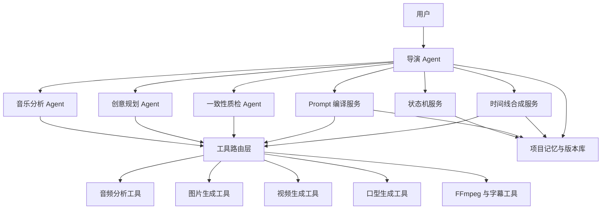

# VidMuse 多 Agent 协议与 Prompt 编译规范

> 文档目标：定义多 Agent 架构中的角色边界、职责分工、内部通信协议、系统提示词分层、任务提示词和 Prompt 编译体系。
>
> 这份文档的核心问题不是“怎么接模型”，而是：
> - 哪些是 Agent
> - 哪些是 Tool
> - 哪些是 Service
> - 它们分别负责什么
> - 用户需求如何被翻译成结构化任务
> - 不同图片/视频 provider 的提示词如何统一编译
> - 系统提示词、任务提示词、Tool 参数之间如何区分

---

## 1. 文档定位

前面的文档已经定义了：

- 多 Agent + `LangGraph` 的总体架构
- 项目级记忆
- 状态机和事件流
- 数据库与 API

这份文档要继续回答最容易做乱的一层：

> “智能体到底怎么拆，提示词到底怎么拆，生成模型到底算 Agent、Tool 还是别的东西。”

如果这一层不定义清楚，工程上很快会出现这些问题：

- Director Agent 什么都做，越来越肥
- Prompt 写法散落在不同模块里
- 换一个 provider 要改一堆业务代码
- 用户一句“第 8 个镜头更炸一点”无法稳定落成可执行动作
- 同样一个镜头，不同模型提示词不一致，无法回放和对比

---

## 2. 结论先行

这个系统里必须明确三类东西：

### 2.1 Agent

负责：

- 理解
- 规划
- 判断
- 解释
- 路由

Agent 是“思考层”。

### 2.2 Service

负责：

- 规则化转换
- 编译
- 校验
- 状态推进
- 一致性处理

Service 是“系统逻辑层”。

### 2.3 Tool

负责：

- 真正执行
- 调第三方模型
- 调音视频工具
- 返回结果

Tool 是“执行层”。

### 2.4 最关键的边界结论

#### 图片生成模型、视频生成模型、口型模型

它们不是 Agent。  
它们应该统一包装成 Tool / Provider Adapter。

#### Prompt 生成

它不应该一开始就做成自由 Agent。  
它应该优先设计成：

> `Prompt Compiler Service`

必要时内部可使用一个专用小型 LLM 节点辅助生成，但对系统外部表现为“可重复、可追踪、可适配 provider 的编译器”。

---

## 3. 中文多 Agent 架构图



### 3.1 图的核心含义

- 用户只和 `导演 Agent` 交互
- `导演 Agent` 负责理解和统筹
- 专业 Agent 负责分析、规划、检查
- `Prompt 编译服务` 负责把镜头语义翻译成 provider 可执行 prompt
- 真正的模型调用都走工具层
- 记忆与版本只在项目侧存，不在 Agent 自己脑子里存

---

## 4. 系统中的角色划分

### 4.1 导演 Agent

这是系统里唯一直接面向用户的 Agent。

职责：

- 理解用户输入
- 判断当前处于哪个项目阶段
- 检查缺失字段
- 反问
- 给出结构化选项
- 决定下一步调用哪个专业 Agent 或 Service
- 汇总结果解释给用户
- 在高成本或高影响操作前要求用户确认

不负责：

- 直接写 prompt bundle
- 直接执行图片/视频生成
- 直接改数据库
- 直接推进状态机

### 4.2 音乐分析 Agent

职责：

- 解读音频分析结果
- 生成音乐结构摘要
- 提炼段落节奏和情绪信息
- 输出给创意规划层使用的结构化结果

它不是去跑 `librosa` 或 `WhisperX` 的工具调用器。  
真正跑分析的是 Tool。  
它负责的是“理解分析结果，并转成创作可用语义”。

### 4.3 创意规划 Agent

职责：

- 生成 creative brief
- 生成 scene plan
- 生成 shot plan
- 给出 performance / narrative / atmosphere 的比例
- 标记哪些镜头可能需要 lipsync

它负责“创意组织”和“镜头语义生成”。

### 4.4 一致性质检 Agent

职责：

- 检查角色一致性
- 检查风格一致性
- 检查镜头节奏漂移
- 标记异常镜头
- 给出修复建议

它不负责修复，只负责发现问题和提出建议。

### 4.5 Prompt 编译服务

这不是自由对话 Agent，而是一个强规则服务。

职责：

- 合并多层上下文
- 生成统一的 prompt bundle
- 为不同 provider 做参数映射
- 生成正向 prompt、负向 prompt、引用素材、模型参数

### 4.6 状态机服务

职责：

- 校验动作是否合法
- 推进或回退状态
- 标记下游 stale
- 创建 pending decision

### 4.7 时间线合成服务

职责：

- 按 shot 顺序拼接 clips
- 对齐节拍
- 加字幕
- 加转场
- 产出 preview 与 export

它是成片逻辑，不是 Agent。

---

## 5. 为什么生成模型应该是 Tool，不是 Agent

### 5.1 它们做的是执行，不是理解

图片和视频 provider 的职责是：

- 接收 prompt 和参数
- 生成内容
- 返回结果

它们不需要理解：

- 用户真正要什么
- 当前项目处于什么阶段
- 当前该改哪个 shot
- 修改会影响哪些下游

所以它们不是 Agent。

### 5.2 正确封装方式

每个 provider 都应该包装成标准化 Tool：

- `生成图片`
- `编辑图片`
- `扩图`
- `生成视频`
- `重生成视频`
- `生成口型片段`

例如：

- `tool_generate_image(provider="provider_a")`
- `tool_generate_video(provider="provider_b")`
- `tool_generate_lipsync(provider="provider_c")`

Tool 层只关心：

- 输入参数是否合法
- 是否调用成功
- 结果落到哪里
- 成本是多少

---

## 6. Agent、Service、Tool 的边界表

| 类型 | 名称 | 负责什么 | 不负责什么 |
|---|---|---|---|
| Agent | 导演 Agent | 对话、理解、反问、给选项、路由 | 直接媒体生成 |
| Agent | 音乐分析 Agent | 解释音乐结构、输出节奏语义 | 直接跑底层分析工具 |
| Agent | 创意规划 Agent | brief、scene、shot 规划 | 直接调 provider |
| Agent | 一致性质检 Agent | 发现风格/角色/节奏漂移 | 修改数据库、直接修复 |
| Service | Prompt 编译服务 | prompt bundle 编译、provider 适配 | 用户对话 |
| Service | 状态机服务 | 校验动作、推进状态、标记 stale | 创意规划 |
| Service | 时间线合成服务 | 拼接、字幕、转场、导出编排 | 用户澄清 |
| Tool | 音频分析工具 | BPM、beat、lyrics、section | 创意判断 |
| Tool | 图片生成工具 | 生图、重绘、扩图 | 选择镜头逻辑 |
| Tool | 视频生成工具 | 文生视频、图生视频 | 判断项目状态 |
| Tool | 口型工具 | 唱词镜头生成 | 镜头规划 |
| Tool | FFmpeg 工具 | 切段、合成、导出、字幕烧录 | 理解用户意图 |

---

## 7. 为什么 Prompt 编译必须单独设计

你提到的核心问题是对的：

> 不同的生图和视频模型，提示词写法不一样。

这意味着不能把 prompt 直接写死在某个 Agent 或某个 Tool 里。

### 7.1 问题本质

同一个镜头语义：

- 在模型 A 里适合长描述
- 在模型 B 里适合关键词堆叠
- 在模型 C 里更依赖参考图
- 在模型 D 里参数比文本更重要

如果不做统一编译层，就会导致：

- Provider 切换困难
- 多模型对比困难
- Prompt 不可复用
- Prompt 和业务耦合

### 7.2 正确设计

用户语义不直接变成 provider prompt。  
中间必须经过一层：

> `镜头语义规格 -> Prompt Bundle`

---

## 8. Prompt 编译总流程


### 8.1 关键含义

- 用户说的是自然语言
- 创意规划 Agent 产出的是结构化镜头语义
- Prompt 编译服务把它编译成 provider 可执行的 prompt bundle
- Provider 适配器再做最后一层翻译

---

## 9. Shot Semantic Spec 设计

这是整个系统非常关键的内部对象。

### 9.1 作用

它是“创意层”和“执行层”之间的桥梁。

### 9.2 结构示例

```json
{
  "shot_id": "shot_008",
  "shot_role": "performance",
  "subject": "female singer",
  "location": "rainy night street",
  "emotion": "high-energy melancholy",
  "camera_language": "fast push-in",
  "pace": "fast",
  "color_tone": "cold blue",
  "duration_sec": 2.8,
  "lipsync_required": false,
  "preserve_character": true,
  "style_lock": true,
  "reference_asset_ids": ["asset_char_01", "asset_scene_02"]
}
```

### 9.3 为什么必须有这一层

因为这层是：

- 稳定的
- 可版本化的
- 可重放的
- 和 provider 无关的

真正应该被长期保存和复用的不是最终 prompt，而是 `Shot Semantic Spec`。

---

## 10. Prompt Bundle 设计

### 10.1 定义

`Prompt Bundle` 是 Prompt 编译服务输出给工具层的标准产物。

### 10.2 结构示例

```json
{
  "bundle_id": "pb_001",
  "target_type": "shot_clip",
  "target_id": "shot_008",
  "provider": "video_provider_a",
  "positive_prompt": "cinematic cold blue rainy night street, female singer, fast push-in, emotional chorus, high energy",
  "negative_prompt": "low detail, deformed face, duplicated body, inconsistent outfit",
  "reference_asset_ids": ["asset_char_01", "asset_scene_02"],
  "params": {
    "duration_sec": 2.8,
    "aspect_ratio": "16:9",
    "seed": 123,
    "motion_strength": 0.75
  }
}
```

### 10.3 Prompt Bundle 的意义

它让你做到：

- 同一个 shot 用不同 provider 重试
- 保存每次编译结果
- 对比不同 prompt 版本
- 让 Tool 层完全不用理解业务语义

---

## 11. Prompt 编译服务负责什么

### 11.1 输入

它至少要吃这些输入：

- `project_spec`
- `creative_brief`
- `style_bible`
- `character_set`
- `shot semantic spec`
- `storyboard frame` 或参考图
- `provider profile`
- `user patch`

### 11.2 输出

输出：

- `Prompt Bundle`

### 11.3 职责拆解

#### 1. 合并多层语义

把全局风格、角色信息、场景信息、镜头信息拼成统一语义。

#### 2. 风格锁定

确保全片冷暖、质感、镜头语言一致。

#### 3. 角色锁定

尽量保证：

- 长相
- 发型
- 服装
- 主体身份

#### 4. 负向提示词生成

根据 provider 特性自动生成负向 prompt。

#### 5. 参数适配

例如：

- 持续时长
- 宽高比
- seed
- 运动强度
- 参考图绑定

#### 6. 输出可追踪编译结果

需要记录：

- 输入版本
- 编译原因
- 目标 provider
- 最终 bundle

---

## 12. Provider 适配器设计

### 12.1 为什么需要 Provider 适配器

Prompt 编译服务输出的是统一 bundle，  
但不同 provider 需要：

- 不同字段名
- 不同 prompt 风格
- 不同参数名
- 不同限制

所以必须再做一层 `ProviderAdapter`。

### 12.2 职责

负责：

- 把统一 bundle 转为 provider API 请求
- 删除 provider 不支持的字段
- 做字段映射
- 做 prompt 压缩或扩写

### 12.3 例子

同一个 `duration_sec`：

- Provider A 叫 `duration`
- Provider B 叫 `seconds`
- Provider C 只能给固定值

适配器负责吸收这些差异。

---

## 13. 系统中的提示词分层

这个部分必须明确，否则后面一定乱。

### 13.1 第一层：系统提示词

这是给 Agent 的最高级规则。

作用：

- 定义 Agent 身份
- 定义边界
- 定义不能做什么
- 定义输出格式

例如导演 Agent 的系统提示词会规定：

- 你负责与用户沟通
- 你不能绕过状态机
- 你必须先反问缺失字段
- 你必须输出结构化 action

### 13.2 第二层：角色任务提示词

这是每个专业 Agent 的任务级提示词。

作用：

- 告诉该 Agent 当前的具体任务
- 告诉它可用输入
- 告诉它必须输出什么格式

例如创意规划 Agent：

- 输入音频结构、brief 上下文、style context
- 输出 scene plan 与 shot plan

### 13.3 第三层：编译提示词

这是 Prompt 编译服务内部如果调用 LLM 时使用的提示词。

作用：

- 把结构化镜头语义翻译成 prompt bundle
- 强制遵守 provider profile

### 13.4 第四层：Tool 输入参数

这不是“提示词”，而是执行参数。

例如：

- `duration_sec`
- `aspect_ratio`
- `seed`
- `reference_asset_ids`

它们不属于 Agent 提示词，也不属于用户 prompt。

### 13.5 第五层：Provider Prompt

这是最终送给图片/视频模型的 prompt。

这是最底层的生成提示词。

---

## 14. 不同提示词到底怎么区分

### 14.1 导演 Agent 系统提示词

作用：

- 规定总控行为

关心的是：

- 如何理解用户
- 什么时候反问
- 什么时候要求确认
- 如何输出结构化指令

不关心：

- 图片模型 prompt 怎么写

### 14.2 创意规划 Agent 任务提示词

作用：

- 规划 brief、scene、shot

关心的是：

- 叙事
- 风格
- 镜头节奏

不关心：

- provider 参数格式

### 14.3 Prompt 编译提示词

作用：

- 生成最终可执行 prompt bundle

关心的是：

- 风格锁定
- 角色锁定
- shot 语义落地
- provider profile

### 14.4 Tool 参数

作用：

- 驱动实际生成

关心的是：

- duration
- resolution
- reference images
- seed

---

## 15. Director Agent 协议

### 15.1 输入

- 用户消息
- 当前项目状态
- 当前会话上下文
- 当前项目 memory snapshot

### 15.2 输出

```json
{
  "mode": "clarify | recommend | execute | explain",
  "message": "返回给用户的话",
  "intent": "revise_shot",
  "target": {
    "type": "shot",
    "id": "shot_008"
  },
  "patch": {},
  "missing_fields": [],
  "options": [],
  "estimated_cost": null,
  "requires_confirmation": false,
  "next_action": "call_creative_planning_agent"
}
```

### 15.3 行为规则

- 缺字段先问
- 影响大先确认
- 不直接写 prompt
- 不直接调 provider

---

## 16. 音乐分析 Agent 协议

### 16.1 输入

- 音频分析结果
- 当前项目目标时长
- 用户风格方向

### 16.2 输出

```json
{
  "music_structure_summary": {
    "bpm": 124,
    "sections": [],
    "energy_peaks": [],
    "lyric_highlights": []
  },
  "editing_guidance": {
    "intro_pacing": "slow",
    "chorus_pacing": "fast",
    "recommended_cut_density": "high_in_chorus"
  }
}
```

---

## 17. 创意规划 Agent 协议

### 17.1 输入

- `project_spec`
- `audio_analysis`
- `user_prompt`
- `reference_assets`

### 17.2 输出

- `creative_brief`
- `scene_plan`
- `shot_plan`
- `shot semantic specs`

### 17.3 输出重点

它的核心输出不是长文案，而是可执行的镜头语义对象。

---

## 18. 一致性质检 Agent 协议

### 18.1 输入

- `style_bible`
- `character_set`
- `storyboard_frames`
- `clips`

### 18.2 输出

```json
{
  "issues": [
    {
      "type": "character_drift",
      "target_id": "shot_005",
      "severity": "high",
      "description": "角色服装和前序镜头不一致"
    }
  ],
  "recommendations": [
    {
      "action": "regenerate_shot",
      "target_id": "shot_005",
      "reason": "restore character lock"
    }
  ]
}
```

---

## 19. Prompt 编译服务协议

### 19.1 输入协议

```json
{
  "project_context": {
    "brief_version_id": "brief_v2",
    "style_version_id": "style_v4",
    "character_set_version_id": "char_v1"
  },
  "shot_spec": {
    "shot_id": "shot_008"
  },
  "provider_profile": {
    "provider": "video_provider_a",
    "mode": "image_to_video"
  },
  "reference_asset_ids": ["asset_char_01", "asset_scene_02"]
}
```

### 19.2 输出协议

```json
{
  "bundle_id": "pb_001",
  "positive_prompt": "...",
  "negative_prompt": "...",
  "params": {},
  "reference_asset_ids": []
}
```

### 19.3 行为要求

- 输入必须可追溯到版本
- 输出必须可缓存
- 同一输入应尽量稳定输出

---

## 20. Prompt 编译层次

### 20.1 全局风格层

负责：

- 色调
- 质感
- 灯光
- 时代感
- 视觉风格

### 20.2 角色锁定层

负责：

- 长相
- 服装
- 发型
- 年龄感
- 身份连续性

### 20.3 场景层

负责：

- 地点
- 天气
- 空间元素
- 道具氛围

### 20.4 镜头层

负责：

- 镜头类型
- 运镜
- 表情
- 动作
- 视觉强度
- 时长倾向

### 20.5 Provider 适配层

负责：

- 文本格式调整
- 参数映射
- 支持能力裁剪

---

## 21. 用户修正如何影响 Prompt 重编译

### 21.1 用户修正不是直接改 prompt

例如用户说：

> 第 8 个镜头太慢了，保留这个女生，副歌更炸一点。

系统必须先转成 patch：

```json
{
  "target": "shot_008",
  "patch": {
    "pace": "faster",
    "visual_energy": "high",
    "preserve_character": true
  }
}
```

### 21.2 然后做什么

1. 更新 shot semantic spec
2. 标记旧 prompt bundle 失效
3. 重新调用 Prompt 编译服务
4. 生成新 bundle
5. 触发 clip 重生成

### 21.3 不允许做什么

不允许：

- 直接字符串拼接旧 prompt
- 直接在 Tool 层临时改 prompt

这样会让系统失去可追踪性。

---

## 22. Tool 协议

### 22.1 Tool 输入结构

所有 Tool 都应遵守：

```json
{
  "tool_name": "generate_video",
  "provider": "video_provider_a",
  "project_id": "proj_01",
  "input": {
    "prompt_bundle_id": "pb_001"
  }
}
```

### 22.2 Tool 输出结构

```json
{
  "status": "success",
  "asset_id": "asset_clip_01",
  "provider_payload": {},
  "usage": {
    "credits": 18
  }
}
```

### 22.3 Tool 不能做的事

- 不解释用户意图
- 不自己推断状态
- 不自己决定用哪个 shot
- 不自己修改 active version

---

## 23. 系统提示词体系建议

### 23.1 总体原则

系统提示词不能只有一份“大总提示词”。  
应该按角色拆开。

### 23.2 需要的提示词类型

#### A. 导演 Agent 系统提示词

内容包括：

- 你是总控代理
- 你必须遵守状态机
- 你必须先检查缺失字段
- 你必须要求确认高影响操作
- 你必须输出结构化 action

#### B. 音乐分析 Agent 系统提示词

内容包括：

- 你只负责音乐结构解释
- 你不能做视觉规划
- 你输出结构化节奏和情绪建议

#### C. 创意规划 Agent 系统提示词

内容包括：

- 你只负责 brief、scene、shot
- 你不能生成 provider prompt
- 你必须输出 shot semantic spec

#### D. 一致性质检 Agent 系统提示词

内容包括：

- 你只负责发现漂移和风险
- 你不直接修复
- 你输出 issue 和 recommendation

#### E. Prompt 编译提示词模板

内容包括：

- 输入是什么
- 需要保留哪些全局锁定
- 目标 provider 的能力边界
- 输出必须为 bundle

---

## 24. 提示词模板与代码配置的边界

### 24.1 应该放在提示词里的内容

- 行为边界
- 输出格式
- 创意和语言约束
- 编译风格

### 24.2 应该放在代码配置里的内容

- provider 参数上限
- duration 支持范围
- 分辨率支持范围
- 价格系数
- feature flags

不要把“硬参数上限”写在提示词里当知识。

---

## 25. 第一版建议的 Agent 清单

第一版我建议就这些：

- `导演 Agent`
- `音乐分析 Agent`
- `创意规划 Agent`
- `一致性质检 Agent`

不建议第一版就把每一步都拆成 Agent。

以下更适合先做成 Service：

- `Prompt 编译服务`
- `状态机服务`
- `时间线合成服务`

以下做成 Tool：

- `音频分析工具`
- `图片生成工具`
- `视频生成工具`
- `口型生成工具`
- `FFmpeg 工具`

这套划分最稳。

---

## 26. 第一版建议的 Tool 清单

### 26.1 音频工具

- `提取节拍`
- `提取段落`
- `歌词时间对齐`
- `音频切段`

### 26.2 图像工具

- `生成参考图`
- `重绘参考图`
- `扩图`
- `生成 storyboard 帧`

### 26.3 视频工具

- `文本生成视频`
- `图片生成视频`
- `重生成镜头视频`

### 26.4 口型工具

- `生成演唱镜头`

### 26.5 媒体合成工具

- `生成字幕`
- `拼接时间线`
- `渲染预览`
- `导出成片`

---

## 27. 从用户输入到生成结果的完整链路

### 27.1 首次创作

1. 用户输入需求
2. 导演 Agent 理解并反问
3. 音乐分析 Agent 解读节奏结构
4. 创意规划 Agent 生成 brief / shot semantic specs
5. Prompt 编译服务生成 prompt bundles
6. Tool 层调用图片/视频 provider
7. 一致性质检 Agent 检查结果
8. 时间线合成服务生成 preview
9. 导演 Agent 向用户解释结果并等待修正

### 27.2 用户局部修正

1. 用户说“第 8 个镜头更炸一点”
2. 导演 Agent 解析 target 和 patch
3. 状态机服务校验是否合法
4. 更新该 shot semantic spec
5. Prompt 编译服务重编译 bundle
6. 视频工具重生成该 shot
7. 时间线合成服务替换 segment
8. 一致性质检 Agent 可选复检

---

## 28. 最终结论

这套系统里最重要的不是“多接几个模型”，而是把责任分清楚：

- Agent 负责理解、规划、解释
- Service 负责编译、校验、合成
- Tool 负责执行生成

真正的难点不在 Tool，而在中间层：

- `Shot Semantic Spec`
- `Prompt Compiler`
- `Provider Adapter`

这三层定义好了，系统才会稳定、可扩展、可回退。

---

## 29. 现在可以拍板的结论

- 图片/视频/口型 provider 全部按 Tool 设计，不按 Agent 设计
- 第一版采用 4 个 Agent：导演、音乐分析、创意规划、一致性质检
- Prompt 生成优先做成 `Prompt 编译服务`
- Prompt 体系要拆成：系统提示词、任务提示词、编译提示词、Tool 参数、Provider Prompt
- 系统内部必须长期保存的是 `Shot Semantic Spec` 和 `Prompt Bundle`
- 用户修改永远先改语义对象，再重编译 prompt，不能直接改字符串 prompt

---

## 30. 下一份文档建议

基于当前文档，下一份最适合继续写的是：

- `07_VidMuse前端工作台与交互流程规范.md`

因为现在：

- Agent 架构定了
- 数据和 API 定了
- 状态机定了
- Prompt 编译逻辑定了

下一步就该定义：

- 前端三栏工作台怎么呈现
- Chat、Pipeline、Storyboard、Timeline 怎么联动
- 选项卡、确认卡、局部修改如何交互

